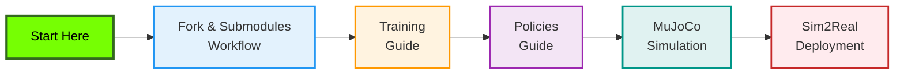

# Berkeley Humanoid Lite Documentation

Comprehensive documentation for the Berkeley Humanoid Lite robot platform, covering everything from training policies in simulation to deploying on real hardware.

## Documentation Overview

This `docs/` folder contains guides specific to this fork and local development workflows. For official project documentation, see the [Berkeley Humanoid Lite GitBook](https://berkeley-humanoid-lite.gitbook.io/docs).

### Quick Links

## Table of Contents

### Getting Started

#### 1. [Fork and Submodules Workflow](fork-and-submodules-workflow.md)
**Essential reading** for understanding how this fork is structured and how to work with git submodules.

**Topics:**
- Repository structure and fork setup
- Submodule initialization and management
- Committing and pushing to multiple repositories
- Handling detached HEAD states
- Syncing with upstream repositories
- Troubleshooting common git issues

**When to read:**
- First time setting up the repository
- Before making any commits
- When encountering submodule issues

**Status:** 🟢 Complete

---

#### 2. [Training Guide](training-guide.md)
Quick reference for training policies using Isaac Lab and Isaac Sim.

**Topics:**
- Training environment setup
- Running training sessions
- Monitoring with TensorBoard
- Training parameters and configuration

**When to read:**
- Before starting your first training run
- When tuning hyperparameters

**Status:** 🟢 Complete

---

### Policy Development

#### 3. [Policies Guide](policies-guide.md)
Comprehensive guide to creating and customizing RL policies for the robot.

**Topics:**
- Understanding the Manager-Based RL framework
- Modifying reward functions
- Creating custom rewards and observations
- Multi-objective policies
- Curriculum learning
- Creating new tasks

**When to read:**
- When customizing robot behavior
- When creating new tasks beyond walking
- When debugging policy performance

**Status:** 🟢 Complete

---

### Simulation and Validation

#### 4. [MuJoCo Simulation Guide](mujoco-simulation-guide.md)
Complete guide for sim2sim validation using MuJoCo before deploying to hardware.

**Topics:**
- MuJoCo environment setup
- Gamepad controller support (PS5 DualSense, Xbox, XInput)
- Debug mode for troubleshooting
- MJCF mesh path configuration
- Multi-rate control loop details
- Troubleshooting simulation issues

**When to read:**
- After exporting a trained policy
- Before deploying to real robot
- When testing gamepad controllers
- When encountering MuJoCo errors

**Status:** 🟢 Complete | **Last Updated:** 2025-10-23 (gamepad multi-controller support)

---

### Real Robot Deployment

#### 5. [Sim2Real Deployment Testing](sim2real-deployment-testing.md)
Step-by-step checklist for deploying trained policies to the real Berkeley Humanoid Lite robot.

**Topics:**
- Pre-deployment checklist
- Hardware setup and verification
- Testing procedures and safety protocols
- **Open Item:** Gamepad controller verification on real hardware
- Troubleshooting deployment issues

**When to read:**
- Before first robot deployment
- When setting up a new robot
- When troubleshooting real robot issues

**Status:** 🟡 Awaiting hardware validation (gamepad changes need testing on real robot)

**⚠️ Action Required:** After deploying to real robot, verify gamepad controller auto-detection works correctly. See section "Open Items & Verification Needed" for details and fallback options.

---

### Hardware and Migration

#### 6. [Jetson Orin Nano Migration](jetson-orin-nano-migration.md)
Guide for migrating from Intel NUC to NVIDIA Jetson Orin Nano for on-board computing.

**Topics:**
- Hardware requirements and setup
- CUDA and TensorRT integration
- Performance optimizations
- Cross-compilation considerations

**When to read:**
- When upgrading on-board computer
- When optimizing policy inference performance

**Status:** 🟢 Complete

---

#### 7. [Upgrade to Isaac Sim 5.0](upgrade-isaac-5.0.md)
Migration guide for upgrading to Isaac Sim 5.0 and Isaac Lab 2.2.

**Topics:**
- Breaking changes
- Version compatibility
- Installation steps

**When to read:**
- When setting up a new development environment
- When encountering version-specific issues

**Status:** 🟢 Complete

---

## Documentation by Use Case

### I Want To...

#### Train a New Policy
1. Read: [Training Guide](training-guide.md)
2. Optional: [Policies Guide](policies-guide.md) - if customizing behavior
3. After training: [MuJoCo Simulation Guide](mujoco-simulation-guide.md) - to validate

#### Customize Robot Behavior
1. Read: [Policies Guide](policies-guide.md)
2. Train: [Training Guide](training-guide.md)
3. Validate: [MuJoCo Simulation Guide](mujoco-simulation-guide.md)

#### Deploy to Real Robot
1. Prerequisite: [MuJoCo Simulation Guide](mujoco-simulation-guide.md) - validate first
2. Follow: [Sim2Real Deployment Testing](sim2real-deployment-testing.md)
3. Reference: [Fork and Submodules Workflow](fork-and-submodules-workflow.md) - if pushing changes

#### Contribute Code Back
1. Make changes following [Fork and Submodules Workflow](fork-and-submodules-workflow.md)
2. Test in [MuJoCo Simulation](mujoco-simulation-guide.md)
3. Create pull requests to upstream repositories

#### Debug Simulation Issues
1. Check: [MuJoCo Simulation Guide](mujoco-simulation-guide.md) - troubleshooting section
2. Enable debug mode: `--debug` flag
3. If gamepad issues: See gamepad controller verification section

---

## Documentation Status Legend

- 🟢 **Complete**: Documentation is comprehensive and up-to-date
- 🟡 **Pending Validation**: Documentation complete but awaiting real-world testing
- 🔴 **In Progress**: Documentation under active development
- ⚠️ **Action Required**: User action needed for verification or testing

---

## Recent Updates

### 2025-10-23
- **Added:** MuJoCo Simulation Guide with gamepad multi-controller support
- **Added:** Sim2Real Deployment Testing guide with safety protocols
- **Added:** Fork and Submodules Workflow comprehensive guide
- **Updated:** Gamepad controller module with PS5 DualSense support
- **Fixed:** MJCF mesh path resolution for MuJoCo loading

### Earlier
- Initial documentation structure
- Training and policies guides
- Hardware migration guides

---

## Additional Resources

### Official Documentation
- **GitBook**: https://berkeley-humanoid-lite.gitbook.io/docs
- **Paper**: https://arxiv.org/abs/2504.17249
- **GitHub**: https://github.com/HybridRobotics/Berkeley-Humanoid-Lite

### Local Development
- **[CLAUDE.md](../CLAUDE.md)**: Complete repository overview and development commands
- **Isaac Lab Docs**: https://isaac-sim.github.io/IsaacLab/
- **MuJoCo**: https://mujoco.org/

### Community
- GitHub Issues: For bug reports and feature requests
- GitHub Discussions: For questions and community support

---

## Contributing to Documentation

Found an issue or want to improve the documentation?

1. Follow the [Fork and Submodules Workflow](fork-and-submodules-workflow.md)
2. Make your changes
3. Test any code examples
4. Create a pull request

**Documentation Standards:**
- Use clear, concise language
- Include code examples where appropriate
- Add Mermaid diagrams for complex workflows
- Keep table of contents updated
- Add changelog entries for significant updates

---

## Research Documentation

The `research/` subfolder contains comprehensive integration guides for advanced AI models and vision-language-action (VLA) systems.

### Available Research Guides

#### AI Model Integrations

**8. [Physical Intelligence π0 Integration](research/pi0-integration.md)** (71 KB)
- Integration guide for π0 (pi-zero) vision-language-action foundation model
- 3.3B parameter VLA model for language-conditioned robot control
- Complete workflow: data collection, fine-tuning, deployment
- Comparison with RL, LeRobot, and Groot N1
- Hardware requirements and optimization strategies

**9. [Google Gemini Robotics Integration](research/gemini-robotics-integration.md)** (55 KB)
- Integration of Gemini 2.0 Multimodal Live API with robot
- Real-time vision, audio, and natural language understanding
- Spatial reasoning and tool use capabilities
- WebRTC-based streaming architecture

**10. [NVIDIA Groot N1 Integration](research/groot-n1-integration.md)** (41 KB)
- Integration guide for NVIDIA's Groot N1 foundation model
- 100B+ parameter VLA with System 2 reasoning
- Requires Jetson Thor or equivalent (2070 TOPS)
- Advanced planning and multi-step task execution

**11. [LeRobot Integration](research/lerobot-integration.md)** (41 KB)
- HuggingFace LeRobot framework integration
- ACT, Diffusion Policy, and VQ-BeT implementations
- Imitation learning from demonstrations
- Dataset management and policy training

### Research Documentation Overview

These guides explore cutting-edge approaches beyond traditional RL:

| Model | Type | Size | Key Feature | Status |
|-------|------|------|-------------|--------|
| **π0** | VLA | 3.3B | Language-guided control | Available Now |
| **Gemini 2.0** | Multimodal LLM | - | Real-time reasoning | Available Now |
| **Groot N1** | VLA | 100B+ | System 2 reasoning | Q4 2025 |
| **LeRobot** | Imitation | 10M-1B | Manipulation focus | Available Now |

### When to Use Research Approaches

**Use Advanced AI Models When:**
- Need natural language instruction following
- Want multi-task capabilities in single model
- Have limited simulation environments
- Deploying to frequently changing environments
- Need visual reasoning and scene understanding

**Stick with Traditional RL When:**
- Optimizing for single well-defined task
- Need maximum performance/speed
- Have good simulation environment
- Want fastest inference (<10ms)
- Hardware constraints (< 8GB GPU)

### Integration Difficulty Ranking

1. **LeRobot** - Easy (established framework, good documentation)
2. **π0** - Medium (good docs, requires demonstration data)
3. **Gemini** - Medium (cloud API, real-time streaming complexity)
4. **Groot N1** - Hard (requires Thor hardware, not yet released)

### Hardware Requirements Summary

| Model | Min GPU | Recommended | Notes |
|-------|---------|-------------|-------|
| **π0** | 8 GB | 16 GB+ | Fine-tuning needs 22.5+ GB |
| **Gemini** | N/A | Cloud API | Requires internet connection |
| **Groot N1** | Thor | 2070 TOPS | Jetson AGX Thor exclusive |
| **LeRobot** | 4 GB | 8 GB+ | Depends on model variant |

### Research Status Legend

- 📘 **Comprehensive**: Detailed integration guide with code examples
- 🔬 **Experimental**: Cutting-edge, may require adaptation
- ⏳ **Future**: Not yet available, preparing for Q4 2025+
- ☁️ **Cloud**: Requires API access and internet connection

All research documents include:
- Architecture overviews with Mermaid diagrams
- Step-by-step integration instructions
- Code examples and deployment scripts
- Performance comparisons
- Troubleshooting guides

For questions about research integrations, refer to the individual guides or create an issue on GitHub.

---

**Last Updated:** 2025-10-23
**Maintained By:** Berkeley Humanoid Lite Fork Contributors
