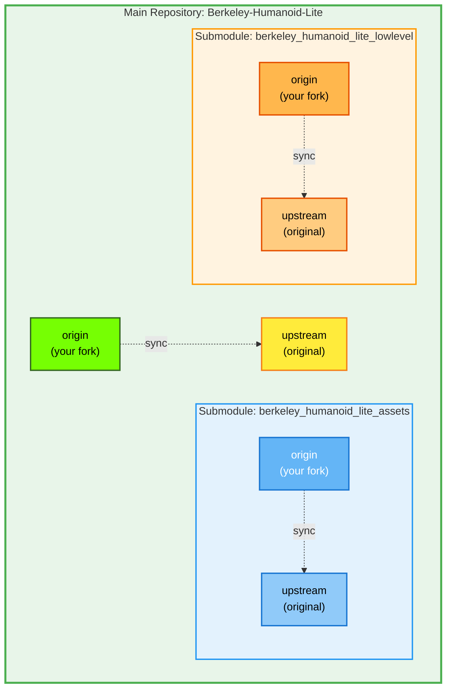

# Fork and Submodules Workflow Guide

This document explains how this repository fork is set up with its submodules and the complete workflow for making changes and pushing to your forks.

## Table of Contents

1. [Repository Structure](#repository-structure)
2. [Fork Setup](#fork-setup)
3. [Submodule Initialization](#submodule-initialization)
4. [Working with Changes](#working-with-changes)
5. [Committing Changes](#committing-changes)
6. [Pushing to Forks](#pushing-to-forks)
7. [Syncing with Upstream](#syncing-with-upstream)
8. [Common Issues and Solutions](#common-issues-and-solutions)

## Repository Structure

This is a **fork of the Berkeley Humanoid Lite project** with a modular architecture using Git submodules.

### Main Repository
- **Origin (Your Fork)**: `https://github.com/kranthie/Berkeley-Humanoid-Lite.git`
- **Upstream (Original)**: `https://github.com/HybridRobotics/Berkeley-Humanoid-Lite`

### Submodules

#### 1. Berkeley Humanoid Lite Assets
- **Path**: `source/berkeley_humanoid_lite_assets/`
- **Origin (Your Fork)**: `https://github.com/kranthie/Berkeley-Humanoid-Lite-Assets.git`
- **Upstream (Original)**: `https://github.com/HybridRobotics/Berkeley-Humanoid-Lite-Assets`
- **Contains**: Robot descriptions (URDF/MJCF/USD files), meshes, generation scripts

#### 2. Berkeley Humanoid Lite Lowlevel
- **Path**: `source/berkeley_humanoid_lite_lowlevel/`
- **Origin (Your Fork)**: `https://github.com/kranthie/Berkeley-Humanoid-Lite-Lowlevel.git`
- **Upstream (Original)**: `https://github.com/HybridRobotics/Berkeley-Humanoid-Lite-Lowlevel`
- **Contains**: C control loop, Python policy inference, gamepad controller, motor drivers

### Workflow Diagram



## Fork Setup

### Initial Fork Creation (Already Done)

1. Forked main repository on GitHub
2. Cloned your fork:
```bash
git clone https://github.com/kranthie/Berkeley-Humanoid-Lite.git
cd Berkeley-Humanoid-Lite
```

3. Added upstream remote:
```bash
git remote add upstream https://github.com/HybridRobotics/Berkeley-Humanoid-Lite
```

4. Verify remotes:
```bash
git remote -v
# Should show:
# origin    https://github.com/kranthie/Berkeley-Humanoid-Lite.git (fetch)
# origin    https://github.com/kranthie/Berkeley-Humanoid-Lite.git (push)
# upstream  https://github.com/HybridRobotics/Berkeley-Humanoid-Lite (fetch)
# upstream  https://github.com/HybridRobotics/Berkeley-Humanoid-Lite (push)
```

## Submodule Initialization

### First Time Setup

When you first clone the repository, submodules are not initialized by default.

```bash
# Initialize and clone all submodules
git submodule update --init --recursive
```

This command:
1. Reads `.gitmodules` file to find submodule definitions
2. Clones each submodule repository
3. Checks out the specific commit referenced by the main repository

### What Happens Behind the Scenes

After initialization:
- Submodules are cloned to their respective paths
- Each submodule is in **"detached HEAD"** state (pointing to a specific commit, not a branch)
- Submodules have their own `.git` directories

### Verify Submodule Status

```bash
# Check submodule status
git submodule status

# Expected output (example):
# 32380c08e1d2ebc41dd0d435a6a2f505b6bcbdb8 source/berkeley_humanoid_lite_assets (v2025.09.03-2-g32380c0)
# 160130d97e3a6a1a594858b57e53f02c5755b2e3 source/berkeley_humanoid_lite_lowlevel (heads/main)
```

The output shows:
- Commit SHA that the main repo references
- Path to submodule
- Branch or tag name (if available)

### Setting Up Submodule Remotes

Each submodule also needs upstream remotes configured:

```bash
# For assets submodule
cd source/berkeley_humanoid_lite_assets
git remote add upstream https://github.com/HybridRobotics/Berkeley-Humanoid-Lite-Assets
cd ../..

# For lowlevel submodule
cd source/berkeley_humanoid_lite_lowlevel
git remote add upstream https://github.com/HybridRobotics/Berkeley-Humanoid-Lite-Lowlevel
cd ../..
```

Verify:
```bash
cd source/berkeley_humanoid_lite_assets
git remote -v

cd ../berkeley_humanoid_lite_lowlevel
git remote -v
```

## Working with Changes

### Understanding Submodule State

**Important**: Submodules are checked out at specific commits, not branches. This can lead to "detached HEAD" state.

### Making Changes

#### 1. Changes in Main Repository Only

```bash
# Make your changes to files in the main repo
vim source/berkeley_humanoid_lite/environments/mujoco.py

# Check status
git status

# Stage and commit
git add source/berkeley_humanoid_lite/environments/mujoco.py
git commit -m "Your commit message"
```

#### 2. Changes in Submodules Only

```bash
# Navigate to submodule
cd source/berkeley_humanoid_lite_lowlevel

# IMPORTANT: Check out a branch first (avoid detached HEAD)
git checkout main

# Make your changes
vim berkeley_humanoid_lite_lowlevel/policy/gamepad.py

# Check status
git status

# Stage and commit IN THE SUBMODULE
git add berkeley_humanoid_lite_lowlevel/policy/gamepad.py
git commit -m "Add multi-controller support"

# Return to main repo
cd ../..

# Check main repo status - will show submodule as modified
git status
```

#### 3. Changes in Both Main Repo and Submodules

```bash
# 1. Work in submodule first
cd source/berkeley_humanoid_lite_lowlevel
git checkout main
# ... make changes ...
git add .
git commit -m "Submodule changes"
cd ../..

# 2. Then work in main repo
# ... make changes to main repo files ...
git add .
# This also stages the updated submodule reference
git commit -m "Main repo changes + updated submodule reference"
```

### Avoiding Detached HEAD in Submodules

**Always checkout a branch before making changes in submodules:**

```bash
cd source/berkeley_humanoid_lite_lowlevel
git checkout main  # or create a new branch: git checkout -b feature-branch
# Now make your changes
```

If you end up in detached HEAD after committing:

```bash
# You have commit 32380c0 but HEAD is detached
git checkout main      # Switch to main branch
git merge 32380c0      # Merge your commit into main
# or
git cherry-pick 32380c0  # Apply your commit to main
```

## Committing Changes

### Complete Commit Workflow

#### Step 1: Commit to Submodules First

**Always commit submodule changes before committing in the main repo.**

```bash
# For lowlevel submodule
cd source/berkeley_humanoid_lite_lowlevel
git checkout main  # Ensure you're on a branch
git add berkeley_humanoid_lite_lowlevel/policy/gamepad.py
git commit -m "Add multi-controller support with auto-detection

- Add ControllerProfile dataclass
- Support DualSense and XInput controllers
- Fix PS5 normalization issue"

# For assets submodule
cd ../berkeley_humanoid_lite_assets
git checkout main  # Ensure you're on a branch
git add data/robots/berkeley_humanoid/berkeley_humanoid_lite/mjcf/*.xml
git commit -m "Fix MJCF mesh path resolution

- Change meshdir to '.'
- Update mesh paths to '../meshes/*.stl'"

cd ../..
```

#### Step 2: Commit to Main Repository

```bash
# Main repo will now show submodules as modified
git status
# Output:
#   modified:   source/berkeley_humanoid_lite_assets (new commits)
#   modified:   source/berkeley_humanoid_lite_lowlevel (new commits)

# Stage all changes including submodule references
git add .

# Commit
git commit -m "Update submodules with gamepad and MJCF fixes

- Updated lowlevel submodule: gamepad multi-controller support
- Updated assets submodule: MJCF mesh path fixes"
```

### What Gets Committed

When you commit in the main repository after submodule changes:
- The main repo stores the **new commit SHA** of each submodule
- The actual code changes are in the submodule repositories
- Main repo's commit just updates the pointer to the new submodule commit

### Viewing Commit Structure

```bash
# Show what commit the main repo references for submodules
git ls-tree HEAD source/berkeley_humanoid_lite_assets
git ls-tree HEAD source/berkeley_humanoid_lite_lowlevel

# Show submodule commit history
cd source/berkeley_humanoid_lite_lowlevel
git log --oneline -5
cd ../..
```

## Pushing to Forks

### Push Order Matters!

**Always push submodules BEFORE pushing the main repository.**

If you push the main repo first, it will reference submodule commits that don't exist on GitHub yet, causing errors for others trying to clone.

### Complete Push Workflow

```bash
# 1. Push lowlevel submodule
cd source/berkeley_humanoid_lite_lowlevel
git push origin main
cd ../..

# 2. Push assets submodule
cd source/berkeley_humanoid_lite_assets
git push origin main
cd ../..

# 3. Finally, push main repository
git push origin main
```

### Verification

```bash
# Check that everything is pushed
git status
# Should show: "Your branch is up to date with 'origin/main'"

cd source/berkeley_humanoid_lite_lowlevel
git status
# Should show: "Your branch is up to date with 'origin/main'"

cd ../berkeley_humanoid_lite_assets
git status
# Should show: "Your branch is up to date with 'origin/main'"
```

### Push to Upstream (Creating Pull Requests)

If you want to contribute back to the original repositories:

```bash
# For main repo
git push origin main  # Push to your fork first
# Then create PR on GitHub: kranthie/Berkeley-Humanoid-Lite → HybridRobotics/Berkeley-Humanoid-Lite

# For submodules
cd source/berkeley_humanoid_lite_lowlevel
git push origin main
# Create PR: kranthie/Berkeley-Humanoid-Lite-Lowlevel → HybridRobotics/Berkeley-Humanoid-Lite-Lowlevel

cd ../berkeley_humanoid_lite_assets
git push origin main
# Create PR: kranthie/Berkeley-Humanoid-Lite-Assets → HybridRobotics/Berkeley-Humanoid-Lite-Assets
```

## Syncing with Upstream

### Fetching Upstream Changes

```bash
# Main repository
git fetch upstream
git merge upstream/main
# or
git rebase upstream/main

# Submodules
cd source/berkeley_humanoid_lite_lowlevel
git fetch upstream
git merge upstream/main
cd ../..

cd source/berkeley_humanoid_lite_assets
git fetch upstream
git merge upstream/main
cd ../..
```

### Updating Submodules After Upstream Changes

If upstream changes the submodule references:

```bash
# Update main repo
git fetch upstream
git merge upstream/main

# Update submodules to new references
git submodule update --recursive
```

### Complete Sync Workflow

```bash
# 1. Fetch all changes
git fetch upstream
git submodule foreach git fetch upstream

# 2. Merge main repo
git merge upstream/main

# 3. Update submodules to match new references
git submodule update --recursive

# 4. Merge submodule changes
cd source/berkeley_humanoid_lite_lowlevel
git checkout main
git merge upstream/main
cd ../..

cd source/berkeley_humanoid_lite_assets
git checkout main
git merge upstream/main
cd ../..
```

## Common Issues and Solutions

### Issue 1: Detached HEAD in Submodule

**Problem:**
```bash
cd source/berkeley_humanoid_lite_assets
git status
# HEAD detached at 32380c0
```

**Solution:**
```bash
# If you have uncommitted changes
git stash

# Checkout main branch
git checkout main

# If you already committed in detached state
git merge 32380c0  # or the commit SHA shown

# Restore stashed changes if any
git stash pop
```

### Issue 2: Submodule Shows Modified but No Changes

**Problem:**
```bash
git status
# modified:   source/berkeley_humanoid_lite_lowlevel (modified content)
```
But when you check the submodule, nothing is modified.

**Solution:**
This usually means the submodule is on a different commit than what the main repo expects.

```bash
# See what commit main repo expects
git ls-tree HEAD source/berkeley_humanoid_lite_lowlevel

# See what commit submodule is on
cd source/berkeley_humanoid_lite_lowlevel
git rev-parse HEAD

# To reset submodule to expected commit
cd ../..
git submodule update source/berkeley_humanoid_lite_lowlevel
```

### Issue 3: Submodule Not Initialized After Clone

**Problem:**
Submodule directories are empty after cloning.

**Solution:**
```bash
git submodule update --init --recursive
```

### Issue 4: Can't Push - "Updates were rejected"

**Problem:**
```bash
git push origin main
# ! [rejected]        main -> main (non-fast-forward)
```

**Solution:**
Someone else pushed changes, or you need to sync:

```bash
# Fetch and merge
git fetch origin
git merge origin/main

# Or rebase
git fetch origin
git rebase origin/main

# Then push
git push origin main
```

### Issue 5: Forgot to Commit Submodule Changes

**Problem:**
Pushed main repo but forgot to push submodules.

**Solution:**
```bash
# Push the submodules now
cd source/berkeley_humanoid_lite_lowlevel
git push origin main
cd ../..

cd source/berkeley_humanoid_lite_assets
git push origin main
cd ../..

# Anyone cloning will now get the correct commits
```

### Issue 6: Submodule Commits Don't Exist on Remote

**Problem:**
After cloning, you get:
```
fatal: remote error: upload-pack: not our ref 32380c0...
```

**Solution:**
The main repo references a submodule commit that doesn't exist on GitHub yet. The person who pushed needs to:

```bash
cd source/berkeley_humanoid_lite_lowlevel
git push origin main
```

## Best Practices

### 1. Always Work on Branches in Submodules

```bash
cd source/berkeley_humanoid_lite_lowlevel
git checkout main  # or create feature branch
# Never work in detached HEAD state
```

### 2. Commit Submodules First, Main Repo Last

```bash
# ✅ Correct order
cd source/berkeley_humanoid_lite_lowlevel
git commit -m "..."
cd ../..
git commit -m "Update submodule reference"

# ❌ Wrong - don't commit main repo first
git commit -m "..."
cd source/berkeley_humanoid_lite_lowlevel
git commit -m "..."  # Main repo now points to old commit!
```

### 3. Push Submodules First, Main Repo Last

```bash
# ✅ Correct order
cd source/berkeley_humanoid_lite_lowlevel && git push origin main && cd ../..
cd source/berkeley_humanoid_lite_assets && git push origin main && cd ../..
git push origin main

# ❌ Wrong - others can't clone!
git push origin main  # References commits that don't exist yet on GitHub
```

### 4. Regularly Sync with Upstream

```bash
# At least once a week
git fetch upstream
cd source/berkeley_humanoid_lite_lowlevel && git fetch upstream && cd ../..
cd source/berkeley_humanoid_lite_assets && git fetch upstream && cd ../..
```

### 5. Use `git submodule status` Frequently

```bash
# Check submodule state before committing
git submodule status
```

### 6. Document Your Workflow

Keep notes about:
- Which submodules you're actively modifying
- What branches you're working on in each submodule
- Upstream sync schedule

## Quick Reference Commands

```bash
# Initialize submodules
git submodule update --init --recursive

# Check submodule status
git submodule status

# Update submodules to latest referenced commits
git submodule update --recursive

# Make changes in submodule (proper workflow)
cd source/berkeley_humanoid_lite_lowlevel
git checkout main
# ... make changes ...
git add .
git commit -m "..."
cd ../..
git add source/berkeley_humanoid_lite_lowlevel
git commit -m "Update submodule reference"

# Push everything (in correct order)
cd source/berkeley_humanoid_lite_lowlevel && git push origin main && cd ../..
cd source/berkeley_humanoid_lite_assets && git push origin main && cd ../..
git push origin main

# Sync with upstream
git fetch upstream
git merge upstream/main
git submodule update --recursive
```

## Related Documentation

- [CLAUDE.md](../CLAUDE.md) - Complete codebase development guide
- [MuJoCo Simulation Guide](mujoco-simulation-guide.md) - Sim2sim validation
- [Sim2Real Deployment Testing](sim2real-deployment-testing.md) - Real robot deployment

## Troubleshooting Help

If you encounter issues not covered here:

1. Check submodule state: `git submodule status`
2. Check what branch you're on: `git branch` (in both main repo and submodules)
3. Check remote configuration: `git remote -v`
4. Check commit history: `git log --oneline -5`
5. For submodule issues: `git submodule update --init --recursive`

## Changelog

### 2025-10-23
- Initial fork and submodules workflow documentation
- Documented detached HEAD issue and resolution
- Added complete commit and push workflows
- Included troubleshooting section
