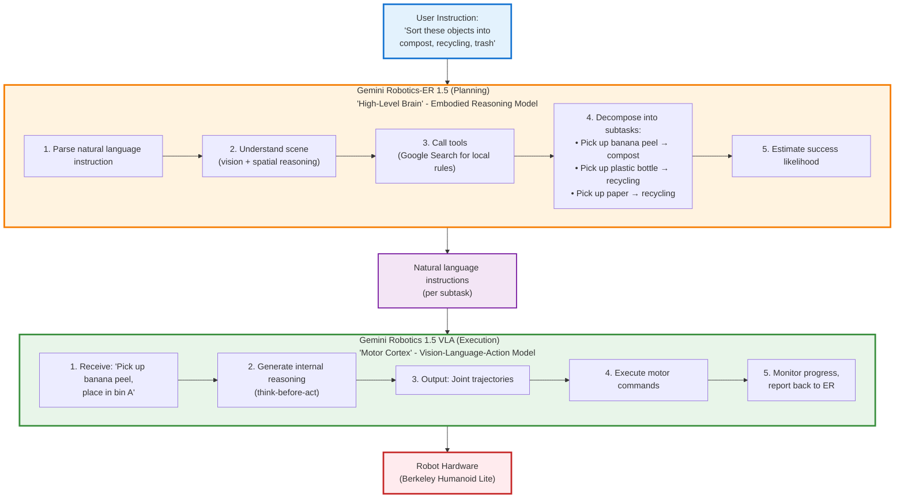
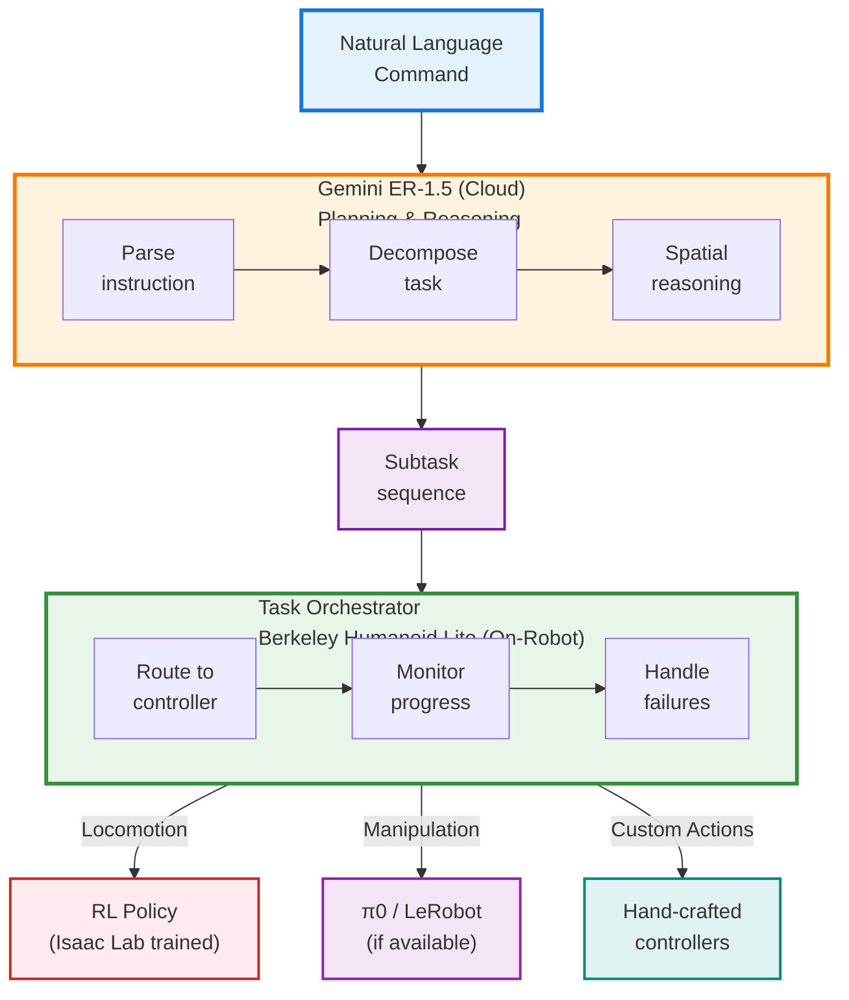
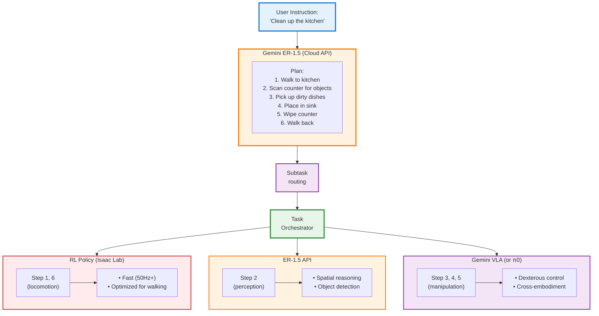

# Google Gemini Robotics Integration Guide

Comprehensive guide for integrating Google DeepMind's Gemini Robotics models (ER-1.5 and VLA) with Berkeley Humanoid Lite.

## Table of Contents

1. [What is Gemini Robotics?](#what-is-gemini-robotics)
2. [Model Architecture](#model-architecture)
3. [Model Variants](#model-variants)
4. [Hardware Requirements](#hardware-requirements)
5. [Integration Approach](#integration-approach)
6. [Phase 1: ER-1.5 API Setup](#phase-1-er-15-api-setup)
7. [Phase 2: Task Planning Implementation](#phase-2-task-planning-implementation)
8. [Phase 3: VLA Integration (Waitlist Required)](#phase-3-vla-integration-waitlist-required)
9. [Phase 4: Hybrid System Deployment](#phase-4-hybrid-system-deployment)
10. [Comparison with Other Approaches](#comparison-with-other-approaches)
11. [Performance Optimization](#performance-optimization)
12. [Troubleshooting](#troubleshooting)
13. [References](#references)

---

## What is Gemini Robotics?

**Gemini Robotics** is Google DeepMind's AI system for bringing agentic capabilities to the physical world. Released in September 2025, it represents a dual-model architecture that separates high-level reasoning from low-level motor control.

### Key Components

1. **Gemini Robotics-ER 1.5** (Embodied Reasoning)
   - Vision-language model (VLM) for reasoning and planning
   - Available NOW via Gemini API
   - Acts as "high-level brain" for robots

2. **Gemini Robotics 1.5** (Vision-Language-Action)
   - VLA model for direct motor control
   - Limited access (waitlist only)
   - Executes plans from ER model

### Key Features

**Gemini Robotics-ER 1.5**:
- **Spatial Understanding**: State-of-the-art object detection and localization
- **Task Planning**: Decomposes complex instructions into subtasks
- **Natural Language**: Interact with robots using everyday language
- **Tool Calling**: Can invoke Google Search, VLA models, custom functions
- **Progress Estimation**: Monitors task completion and success
- **Flexible Thinking**: Adjustable thinking budget for latency vs accuracy
- **Multi-Modal**: Processes images, video, audio, and text
- **Large Context**: 1M+ token input, 65K token output

**Gemini Robotics 1.5 (VLA)**:
- **Direct Motor Control**: Generates low-level robot actions
- **Cross-Embodiment**: Works across different robot platforms
- **Transparent Reasoning**: Shows internal thought process
- **On-Device Capable**: Can run locally on robots (via On-Device variant)
- **Think-Before-Act**: Generates reasoning before executing

### What Gemini Robotics Can Do

Demonstrated capabilities:
- **Multi-Step Tasks**: "Clean the kitchen" → plan → execute subtasks
- **Sorting**: Laundry by color, fruit by type, trash/recycling/compost
- **Adaptive Behavior**: Recognize environment changes (e.g., moved baskets)
- **Spatial Reasoning**: Precise 2D pointing, object placement planning
- **Cross-Embodiment Transfer**: Tasks from ALOHA 2 work on Apollo humanoid
- **Safety Reasoning**: Semantic understanding of physical constraints

### Availability

| Model | Availability | Access Method |
|-------|-------------|---------------|
| **Gemini Robotics-ER 1.5** | ✅ Available Now | Google AI Studio / Gemini API |
| **Gemini Robotics 1.5 (VLA)** | ⏳ Limited Access | Waitlist only (select partners) |
| **Gemini Robotics On-Device** | ⏳ Limited Access | Waitlist only |

---

## Model Architecture

### Dual-Model Design

Gemini Robotics uses a hierarchical architecture that separates reasoning from execution:



### Information Flow

1. **User → ER-1.5**: Natural language instruction
2. **ER-1.5**: Reasons about task, creates plan, decomposes into subtasks
3. **ER-1.5 → VLA**: Sends natural language sub-instructions
4. **VLA**: Generates motor commands for each subtask
5. **VLA → Robot**: Low-level joint trajectories
6. **Robot → VLA**: State feedback (proprioception, vision)
7. **VLA → ER-1.5**: Progress updates, success/failure signals
8. **ER-1.5**: Monitors, adjusts plan if needed, calls tools

### Why This Architecture?

**Advantages of separation**:
- **Modularity**: Swap VLA models, use different controllers for different tasks
- **Scalability**: ER-1.5 via API (cloud), VLA on-device (low latency)
- **Flexibility**: ER can call any tool (search, vision models, custom APIs)
- **Transparency**: See reasoning process, debug failures
- **Efficiency**: VLA only needs to handle execution, not planning

**Comparison to end-to-end VLA** (like π0):
- π0: Single model does everything (planning + execution)
- Gemini: Two models, specialized roles
- π0: Simpler pipeline, but less flexible
- Gemini: More complex, but more powerful for multi-step tasks

---

## Model Variants

### Gemini Robotics-ER 1.5 (Embodied Reasoning)

**Model ID**: `gemini-robotics-er-1.5-preview`

**Type**: Vision-Language Model (VLM) with embodied reasoning capabilities

**Purpose**: High-level task planning, spatial reasoning, tool orchestration

**Architecture**:
- Built on Gemini 2.5 Flash foundation
- Specialized fine-tuning for robotics reasoning
- Native tool calling (function calling API)
- Adjustable thinking budget

**Input**:
- Text (natural language instructions, queries)
- Images (RGB camera feeds, scene understanding)
- Video (temporal reasoning, progress monitoring)
- Audio (voice commands)

**Output**:
- Text (plans, reasoning, tool calls)
- Structured JSON (object locations, subtask lists)
- 2D points (object localization coordinates)

**Context Window**:
- Input: 1,048,576 tokens (~800 images or ~1 hour video)
- Output: 65,536 tokens

**Capabilities**:
- Object detection and 2D pointing
- Spatial reasoning (relative positions, distances)
- Task decomposition and planning
- Tool calling (Google Search, custom functions, VLA invocation)
- Progress and success estimation
- Trajectory planning
- Multi-step reasoning

**Thinking Budget**:
- Configurable parameter (0 to high)
- Low budget: Fast, for simple tasks (object detection)
- High budget: Slower, for complex reasoning (counting, planning)
- Tradeoff: Latency vs accuracy

**Availability**: ✅ Available NOW via Gemini API

**Pricing**: Standard Gemini API pricing (preview may have special rates)

**Use Cases for Berkeley Humanoid Lite**:
- "Walk to the kitchen and pick up the red cup"
- "Sort objects on table by size"
- "Clean up the room"
- "Follow me while carrying this box"

### Gemini Robotics 1.5 (VLA)

**Type**: Vision-Language-Action Model (VLA)

**Purpose**: Direct motor control, low-level execution

**Architecture**:
- Transformer-based VLA
- Cross-embodiment training
- Think-before-act reasoning
- Internal reasoning tokens (transparent execution)

**Input**:
- RGB images (robot cameras)
- Proprioception (joint positions, velocities)
- Natural language instruction (from ER or user)

**Output**:
- Joint trajectories (position targets over time)
- Gripper commands (open/close, force control)

**Training Data**:
- Trained on diverse robot platforms
- ALOHA 2, Franka arms, mobile manipulators
- Demonstrated cross-embodiment transfer

**Capabilities**:
- Dexterous manipulation
- Locomotion control
- Cross-platform generalization
- Transparent reasoning (shows thought process)

**Availability**: ⏳ Waitlist only (select partners)

**Use Cases**:
- Fine motor control (grasping, manipulation)
- Whole-body coordination (humanoid locomotion + manipulation)
- Low-latency execution (on-device capable)

### Gemini Robotics On-Device

**Type**: Optimized VLA for on-device inference

**Purpose**: Low-latency, offline-capable robot control

**Characteristics**:
- Runs locally on robot hardware
- No internet required (after deployment)
- Lower latency than cloud VLA
- Optimized for edge devices

**Availability**: ⏳ Waitlist only

**Hardware Requirements**: TBD (likely requires significant GPU, similar to π0)

### Model Selection for Berkeley Humanoid Lite

| Scenario | Recommended Model | Reason |
|----------|------------------|--------|
| **Task Planning** | ER-1.5 (API) | Available now, powerful reasoning |
| **Locomotion Control** | RL Policy (existing) | Optimized, low latency, proven |
| **Manipulation** | VLA (waitlist) | Dexterous, cross-embodiment |
| **Whole-Body Tasks** | ER-1.5 + RL/π0 hybrid | ER plans, RL/π0 executes |
| **Complex Multi-Step** | ER-1.5 + VLA (future) | Best of both worlds |

**Practical Recommendation**: Start with ER-1.5 for planning + existing RL policies for execution, transition to VLA when access is granted.

---

## Hardware Requirements

### Gemini Robotics-ER 1.5 (API-Based)

**Since ER-1.5 runs in the cloud via API, hardware requirements are minimal**:

| Component | Requirement | Notes |
|-----------|-------------|-------|
| **Internet** | Stable connection | 1+ Mbps recommended |
| **Latency** | <200ms to API | Impacts planning speed |
| **Local Compute** | Minimal | Just API calls |
| **Memory** | <1 GB | For client code |

**Ideal for**:
- Development and prototyping
- Tasks where 500ms-2s planning latency is acceptable
- Scenarios with reliable internet

**Not ideal for**:
- Real-time reactive control (<100ms)
- Offline operation (no internet)
- Environments with unreliable connectivity

### Gemini Robotics 1.5 VLA (When Available)

**On-Device Deployment** (estimated, based on similar VLA models):

| Component | Minimum | Recommended | Notes |
|-----------|---------|-------------|-------|
| **GPU Memory** | 8 GB | 16+ GB | VLA models typically 3-10B params |
| **GPU Compute** | 100+ TOPS | 200+ TOPS | For 50Hz control |
| **CPU** | 8-core ARM/x86 | 16-core | Data preprocessing |
| **RAM** | 16 GB | 32 GB | Frame buffers |
| **Storage** | 50 GB | 100+ GB | Model checkpoints |

**Jetson Compatibility** (estimated):
- **Jetson Orin Nano Super (8GB)**: Marginal - may work with optimizations
- **Jetson AGX Orin (32/64GB)**: Yes - good fit
- **Jetson AGX Thor (128GB, 2070 TOPS)**: Excellent - full capabilities

### Berkeley Humanoid Lite On-Robot Hardware

**Current hardware** (Intel N95 mini PC):
- ❌ Insufficient for on-device VLA
- ✅ Sufficient for ER-1.5 API client

**Recommended upgrades** (for VLA deployment):
- Jetson AGX Orin 32GB: ~$1,599 (good balance)
- Jetson AGX Thor: $3,499 (future-proof, overkill for now)
- External GPU workstation: Tethered control (dev/testing)

**Practical approach**:
1. Use current mini PC for ER-1.5 API calls
2. Run VLA (when available) on development workstation
3. Upgrade to Jetson when ready for autonomous operation

---

## Integration Approach

### Why Gemini Robotics for Berkeley Humanoid Lite?

**Advantages**:
1. **Available Now**: ER-1.5 accessible via API (no waitlist)
2. **Powerful Reasoning**: State-of-the-art spatial understanding and planning
3. **Natural Language**: Intuitive control via everyday language
4. **Tool Calling**: Can invoke existing RL policies, π0, or custom controllers
5. **Modular**: Flexible architecture, swap execution models
6. **Google Ecosystem**: Integration with Search, other Google AI services
7. **Safety-Aware**: Semantic reasoning about physical constraints

**Challenges**:
1. **Cloud Dependency**: ER-1.5 requires internet (API-based)
2. **Latency**: Planning takes 500ms-2s (not suitable for reactive control)
3. **VLA Access**: Main execution model requires waitlist
4. **Cost**: API usage fees (though likely reasonable)
5. **Integration Complexity**: Medium - need to bridge ER-1.5 with existing controllers

**Difficulty Rating**: **Medium** (easier than training VLA from scratch, requires integration work)

### Integration Strategy

**Phase 1** (Immediate - ER-1.5 Only):
- Deploy ER-1.5 as planning layer
- Use existing RL policies for execution
- Natural language commands → task plans → RL policy invocation

**Phase 2** (When VLA Access Granted):
- Integrate Gemini Robotics 1.5 VLA
- ER-1.5 for planning, VLA for execution
- Full Gemini Robotics stack

**Phase 3** (Optional - Hybrid):
- ER-1.5: Task planning and decomposition
- VLA: Manipulation tasks
- RL policies: Locomotion (faster, optimized)
- Best tool for each subtask

### Timeline Estimate

| Phase | Duration | Effort | Deliverable |
|-------|----------|--------|-------------|
| 1. ER-1.5 API Setup | 1-2 days | Low | Working API integration |
| 2. Task Planning | 1-2 weeks | Medium | Natural language control |
| 3. VLA Access | TBD | N/A | Waitlist dependent |
| 4. VLA Integration | 2-4 weeks | Medium-High | Full stack |
| 5. Deployment | 1-2 weeks | High | Real robot testing |

**Total**: 6-10 weeks for Phase 1+2 (ER-1.5 only), additional 3-6 weeks when VLA available

---

## Phase 1: ER-1.5 API Setup

### Step 1.1: Get API Access

**Create Google AI Studio Account**:

1. Visit [Google AI Studio](https://aistudio.google.com/)
2. Sign in with Google account
3. Navigate to "Get API Key"
4. Create new API key
5. Save key securely (e.g., environment variable)

```bash
# Set API key in environment
export GEMINI_API_KEY="your-api-key-here"

# Or add to ~/.bashrc for persistence
echo 'export GEMINI_API_KEY="your-api-key-here"' >> ~/.bashrc
source ~/.bashrc
```

### Step 1.2: Install Google GenAI SDK

```bash
# In your Berkeley Humanoid Lite project
cd /home/kranthi/Projects/Berkeley-Humanoid-Lite

# Install Google GenAI SDK
uv pip install google-genai

# Verify installation
python -c "from google import genai; print('GenAI SDK installed successfully')"
```

### Step 1.3: Test ER-1.5 Connection

```python
"""
Test Gemini Robotics-ER 1.5 API connection.
"""

from google import genai
from google.genai import types
import os

# Initialize client
api_key = os.environ.get('GEMINI_API_KEY')
if not api_key:
    raise ValueError("GEMINI_API_KEY environment variable not set")

client = genai.Client(api_key=api_key)

# Model ID
MODEL_ID = "gemini-robotics-er-1.5-preview"

# Simple test query
response = client.models.generate_content(
    model=MODEL_ID,
    contents="Describe the capabilities of an embodied AI system for robotics.",
    config=types.GenerateContentConfig(
        temperature=0.7,
        thinking_config=types.ThinkingConfig(thinking_budget=0)
    )
)

print("Response from ER-1.5:")
print(response.text)
print("\nAPI connection successful!")
```

### Step 1.4: Test Spatial Reasoning

```python
"""
Test ER-1.5 spatial reasoning with image.
"""

from google import genai
from google.genai import types
import os
from pathlib import Path

client = genai.Client(api_key=os.environ['GEMINI_API_KEY'])
MODEL_ID = "gemini-robotics-er-1.5-preview"

# Load test image (e.g., kitchen scene with objects)
image_path = Path("test_images/kitchen_scene.jpg")

if not image_path.exists():
    print("Please provide a test image at test_images/kitchen_scene.jpg")
    exit(1)

with open(image_path, 'rb') as f:
    image_bytes = f.read()

# Ask ER-1.5 to identify and locate objects
response = client.models.generate_content(
    model=MODEL_ID,
    contents=[
        types.Part.from_bytes(data=image_bytes, mime_type='image/jpeg'),
        "Point to all objects in this scene and describe what you see."
    ],
    config=types.GenerateContentConfig(
        temperature=0.3,  # Lower for more deterministic output
        thinking_config=types.ThinkingConfig(thinking_budget=2)  # Medium budget
    )
)

print("ER-1.5 Spatial Analysis:")
print(response.text)

# Example output format:
# "I see the following objects:
# 1. Red mug at position (245, 120) - top-left of counter
# 2. Blue plate at position (580, 340) - center of table
# 3. Orange at position (720, 380) - right side of table
# ..."
```

---

## Phase 2: Task Planning Implementation

Integrate ER-1.5 as a task planning layer that orchestrates your existing robot controllers.

### Architecture Overview



### Step 2.1: Create ER-1.5 Planning Interface

```python
"""
Gemini ER-1.5 task planner for Berkeley Humanoid Lite.
"""

from google import genai
from google.genai import types
from typing import List, Dict, Optional
import json
import os
from dataclasses import dataclass
from enum import Enum

class ActionType(Enum):
    """Types of actions the robot can perform."""
    LOCOMOTION = "locomotion"      # Walking, turning
    MANIPULATION = "manipulation"  # Grasping, placing
    PERCEPTION = "perception"      # Look at, scan area
    WAIT = "wait"                  # Pause, hold position
    CUSTOM = "custom"              # User-defined

@dataclass
class Subtask:
    """Single subtask in a plan."""
    action_type: ActionType
    instruction: str
    parameters: Dict
    estimated_duration: float  # seconds

@dataclass
class TaskPlan:
    """Complete task plan from ER-1.5."""
    original_instruction: str
    subtasks: List[Subtask]
    estimated_total_time: float
    success_criteria: str

class GeminiRoboticsPlanner:
    def __init__(
        self,
        api_key: Optional[str] = None,
        model_id: str = "gemini-robotics-er-1.5-preview",
        thinking_budget: int = 3,
    ):
        """
        Initialize Gemini ER-1.5 planner.

        Args:
            api_key: Gemini API key (or use GEMINI_API_KEY env var)
            model_id: Model identifier
            thinking_budget: Reasoning depth (0=fast, 5=thorough)
        """
        self.api_key = api_key or os.environ.get('GEMINI_API_KEY')
        if not self.api_key:
            raise ValueError("API key required")

        self.client = genai.Client(api_key=self.api_key)
        self.model_id = model_id
        self.thinking_budget = thinking_budget

    def create_plan(
        self,
        instruction: str,
        scene_image: Optional[bytes] = None,
        robot_capabilities: Optional[List[str]] = None,
    ) -> TaskPlan:
        """
        Create task plan from natural language instruction.

        Args:
            instruction: Natural language command (e.g., "pick up the red cup")
            scene_image: Optional RGB image of current scene
            robot_capabilities: List of available actions

        Returns:
            TaskPlan with subtasks
        """
        # Build prompt
        prompt = self._build_planning_prompt(instruction, robot_capabilities)

        # Prepare content
        contents = []
        if scene_image:
            contents.append(
                types.Part.from_bytes(data=scene_image, mime_type='image/jpeg')
            )
        contents.append(prompt)

        # Call ER-1.5
        response = self.client.models.generate_content(
            model=self.model_id,
            contents=contents,
            config=types.GenerateContentConfig(
                temperature=0.3,
                thinking_config=types.ThinkingConfig(
                    thinking_budget=self.thinking_budget
                ),
                response_mime_type="application/json",  # Request JSON output
            )
        )

        # Parse response
        plan_json = json.loads(response.text)
        plan = self._parse_plan(plan_json, instruction)

        return plan

    def _build_planning_prompt(
        self,
        instruction: str,
        capabilities: Optional[List[str]]
    ) -> str:
        """Build prompt for ER-1.5."""
        capabilities_str = "\n".join(f"- {cap}" for cap in capabilities) if capabilities else "- Walk forward/backward\n- Turn left/right\n- Stop"

        prompt = f"""You are a task planner for a humanoid robot called Berkeley Humanoid Lite.

**Robot Capabilities:**
{capabilities_str}

**User Instruction:**
"{instruction}"

**Your Task:**
Create a detailed plan to accomplish this instruction. Break it down into subtasks that the robot can execute sequentially.

**Output Format (JSON):**
{{
  "subtasks": [
    {{
      "action_type": "locomotion" | "manipulation" | "perception" | "wait" | "custom",
      "instruction": "Natural language description of subtask",
      "parameters": {{
        "key": "value",
        // e.g., {{"direction": "forward", "distance": 2.0}} for locomotion
      }},
      "estimated_duration": 5.0  // seconds
    }},
    ...
  ],
  "estimated_total_time": 20.0,
  "success_criteria": "Description of what success looks like"
}}

**Example:**
Instruction: "Walk to the table and pick up the red cup"
Output:
{{
  "subtasks": [
    {{
      "action_type": "perception",
      "instruction": "Look at the scene and locate the table",
      "parameters": {{"target": "table"}},
      "estimated_duration": 2.0
    }},
    {{
      "action_type": "locomotion",
      "instruction": "Walk forward 3 meters toward the table",
      "parameters": {{"direction": "forward", "distance": 3.0}},
      "estimated_duration": 6.0
    }},
    {{
      "action_type": "perception",
      "instruction": "Locate the red cup on the table",
      "parameters": {{"target": "red cup"}},
      "estimated_duration": 2.0
    }},
    {{
      "action_type": "manipulation",
      "instruction": "Reach out and grasp the red cup",
      "parameters": {{"object": "red cup", "grasp_type": "top"}},
      "estimated_duration": 4.0
    }}
  ],
  "estimated_total_time": 14.0,
  "success_criteria": "Robot is holding the red cup"
}}

**Now create the plan for the given instruction. Output ONLY the JSON, no additional text.**
"""
        return prompt

    def _parse_plan(self, plan_json: Dict, original_instruction: str) -> TaskPlan:
        """Parse JSON response into TaskPlan."""
        subtasks = []
        for subtask_dict in plan_json['subtasks']:
            subtask = Subtask(
                action_type=ActionType(subtask_dict['action_type']),
                instruction=subtask_dict['instruction'],
                parameters=subtask_dict['parameters'],
                estimated_duration=subtask_dict['estimated_duration'],
            )
            subtasks.append(subtask)

        plan = TaskPlan(
            original_instruction=original_instruction,
            subtasks=subtasks,
            estimated_total_time=plan_json['estimated_total_time'],
            success_criteria=plan_json['success_criteria'],
        )

        return plan

    def update_plan(
        self,
        current_plan: TaskPlan,
        progress_info: str,
        failure_reason: Optional[str] = None,
    ) -> TaskPlan:
        """
        Update plan based on execution progress or failure.

        Args:
            current_plan: Current task plan
            progress_info: Description of what's been completed
            failure_reason: If a subtask failed, why?

        Returns:
            Updated TaskPlan
        """
        prompt = f"""You are monitoring a robot executing a task.

**Original Instruction:**
"{current_plan.original_instruction}"

**Current Plan:**
{json.dumps([{
    'action_type': st.action_type.value,
    'instruction': st.instruction,
    'parameters': st.parameters
} for st in current_plan.subtasks], indent=2)}

**Progress Update:**
{progress_info}

{"**FAILURE:** " + failure_reason if failure_reason else ""}

**Your Task:**
{"Revise the plan to handle this failure. Consider alternative approaches." if failure_reason else "Adjust the remaining plan based on progress. Remove completed subtasks and refine next steps if needed."}

Output the updated plan in the same JSON format as before.
"""

        response = self.client.models.generate_content(
            model=self.model_id,
            contents=prompt,
            config=types.GenerateContentConfig(
                temperature=0.5,  # Slightly higher for creative problem-solving
                thinking_config=types.ThinkingConfig(thinking_budget=self.thinking_budget),
                response_mime_type="application/json",
            )
        )

        plan_json = json.loads(response.text)
        updated_plan = self._parse_plan(plan_json, current_plan.original_instruction)

        return updated_plan


# Example usage
if __name__ == "__main__":
    planner = GeminiRoboticsPlanner()

    # Create plan
    plan = planner.create_plan(
        instruction="Walk to the kitchen and pick up the red mug",
        robot_capabilities=[
            "Walk forward/backward (0.5 m/s)",
            "Turn left/right (30 deg/s)",
            "Stop and hold position",
            "Reach and grasp objects (dual arms)",
            "Look around (head camera)",
        ]
    )

    print("Generated Plan:")
    print(f"Instruction: {plan.original_instruction}")
    print(f"Estimated time: {plan.estimated_total_time}s")
    print(f"Success criteria: {plan.success_criteria}")
    print("\nSubtasks:")
    for i, subtask in enumerate(plan.subtasks, 1):
        print(f"{i}. [{subtask.action_type.value}] {subtask.instruction}")
        print(f"   Parameters: {subtask.parameters}")
        print(f"   Duration: {subtask.estimated_duration}s")
```

### Step 2.2: Create Task Orchestrator

```python
"""
Task orchestrator that executes plans using available controllers.
"""

from typing import Dict, Callable, Optional
import time
from enum import Enum

class ExecutionStatus(Enum):
    """Status of subtask execution."""
    SUCCESS = "success"
    FAILURE = "failure"
    RUNNING = "running"
    TIMEOUT = "timeout"

class TaskOrchestrator:
    def __init__(
        self,
        planner: GeminiRoboticsPlanner,
        robot_interface,
    ):
        """
        Initialize task orchestrator.

        Args:
            planner: GeminiRoboticsPlanner instance
            robot_interface: Your robot control interface
        """
        self.planner = planner
        self.robot = robot_interface

        # Register action handlers
        self.action_handlers: Dict[ActionType, Callable] = {}
        self._register_default_handlers()

    def _register_default_handlers(self):
        """Register default action handlers."""
        self.register_handler(ActionType.LOCOMOTION, self.handle_locomotion)
        self.register_handler(ActionType.MANIPULATION, self.handle_manipulation)
        self.register_handler(ActionType.PERCEPTION, self.handle_perception)
        self.register_handler(ActionType.WAIT, self.handle_wait)

    def register_handler(
        self,
        action_type: ActionType,
        handler: Callable[[Subtask], ExecutionStatus]
    ):
        """
        Register custom action handler.

        Args:
            action_type: Type of action
            handler: Function that executes the action
        """
        self.action_handlers[action_type] = handler

    def execute_instruction(
        self,
        instruction: str,
        scene_image: Optional[bytes] = None,
        max_retries: int = 2,
    ) -> bool:
        """
        Execute natural language instruction.

        Args:
            instruction: User command
            scene_image: Optional scene image for planning
            max_retries: Maximum replanning attempts on failure

        Returns:
            True if successful, False otherwise
        """
        print(f"\n{'='*60}")
        print(f"Executing: {instruction}")
        print(f"{'='*60}\n")

        # Create initial plan
        print("Creating plan...")
        plan = self.planner.create_plan(
            instruction=instruction,
            scene_image=scene_image,
            robot_capabilities=self.get_robot_capabilities(),
        )

        print(f"\nPlan created ({len(plan.subtasks)} subtasks)")
        print(f"Estimated time: {plan.estimated_total_time}s")
        print(f"Success criteria: {plan.success_criteria}\n")

        # Execute plan
        retry_count = 0
        while retry_count <= max_retries:
            success = self._execute_plan(plan)

            if success:
                print(f"\n✓ Task completed successfully!")
                return True
            else:
                retry_count += 1
                if retry_count <= max_retries:
                    print(f"\n⚠ Task failed, replanning (attempt {retry_count}/{max_retries})...")
                    # Replan with ER-1.5
                    plan = self.planner.update_plan(
                        current_plan=plan,
                        progress_info=f"Completed {self._progress_info}",
                        failure_reason=self._failure_reason,
                    )
                else:
                    print(f"\n✗ Task failed after {max_retries} retries")
                    return False

    def _execute_plan(self, plan: TaskPlan) -> bool:
        """Execute task plan."""
        self._progress_info = ""
        self._failure_reason = None

        for i, subtask in enumerate(plan.subtasks, 1):
            print(f"\nSubtask {i}/{len(plan.subtasks)}: {subtask.instruction}")

            # Get handler for action type
            handler = self.action_handlers.get(subtask.action_type)
            if not handler:
                print(f"  ✗ No handler for action type: {subtask.action_type}")
                self._failure_reason = f"No handler for {subtask.action_type}"
                return False

            # Execute subtask
            start_time = time.time()
            status = handler(subtask)
            duration = time.time() - start_time

            print(f"  Status: {status.value} ({duration:.1f}s)")

            if status == ExecutionStatus.SUCCESS:
                self._progress_info += f"Completed: {subtask.instruction}\n"
            elif status == ExecutionStatus.FAILURE:
                self._failure_reason = f"Failed at subtask {i}: {subtask.instruction}"
                return False
            elif status == ExecutionStatus.TIMEOUT:
                self._failure_reason = f"Timeout at subtask {i}: {subtask.instruction}"
                return False

        return True

    def handle_locomotion(self, subtask: Subtask) -> ExecutionStatus:
        """
        Handle locomotion subtasks.
        Routes to existing RL policy.
        """
        params = subtask.parameters
        direction = params.get('direction', 'forward')
        distance = params.get('distance', 1.0)

        try:
            # Map to RL policy velocity command
            if direction == 'forward':
                velocity = [0.5, 0.0, 0.0]  # [vx, vy, vyaw]
                duration = distance / 0.5
            elif direction == 'backward':
                velocity = [-0.5, 0.0, 0.0]
                duration = distance / 0.5
            elif direction == 'turn_left':
                velocity = [0.0, 0.0, 0.5]  # Rotate
                duration = params.get('angle', 90) / 30  # 30 deg/s
            elif direction == 'turn_right':
                velocity = [0.0, 0.0, -0.5]
                duration = params.get('angle', 90) / 30
            else:
                print(f"  Unknown direction: {direction}")
                return ExecutionStatus.FAILURE

            # Execute with RL policy
            print(f"  Executing: {direction}, {distance}m, {duration:.1f}s")
            success = self.robot.execute_velocity_command(
                velocity=velocity,
                duration=duration,
            )

            return ExecutionStatus.SUCCESS if success else ExecutionStatus.FAILURE

        except Exception as e:
            print(f"  Error: {e}")
            return ExecutionStatus.FAILURE

    def handle_manipulation(self, subtask: Subtask) -> ExecutionStatus:
        """
        Handle manipulation subtasks.
        Routes to π0 or other manipulation controller.
        """
        params = subtask.parameters
        object_name = params.get('object', 'unknown')

        try:
            # If you have π0 or other VLA
            if hasattr(self.robot, 'manipulation_policy'):
                print(f"  Using manipulation policy for: {object_name}")
                success = self.robot.manipulation_policy.execute(
                    instruction=subtask.instruction,
                    object_name=object_name,
                )
                return ExecutionStatus.SUCCESS if success else ExecutionStatus.FAILURE
            else:
                print(f"  ⚠ No manipulation policy available, skipping")
                return ExecutionStatus.SUCCESS  # Graceful degradation

        except Exception as e:
            print(f"  Error: {e}")
            return ExecutionStatus.FAILURE

    def handle_perception(self, subtask: Subtask) -> ExecutionStatus:
        """Handle perception subtasks."""
        params = subtask.parameters
        target = params.get('target', None)

        try:
            print(f"  Looking for: {target}")
            # Capture image, maybe call ER-1.5 for object detection
            image = self.robot.get_camera_image()

            # Could call ER-1.5 here for spatial reasoning
            # For now, just simulate success
            time.sleep(1.0)
            return ExecutionStatus.SUCCESS

        except Exception as e:
            print(f"  Error: {e}")
            return ExecutionStatus.FAILURE

    def handle_wait(self, subtask: Subtask) -> ExecutionStatus:
        """Handle wait subtasks."""
        duration = subtask.parameters.get('duration', 1.0)
        print(f"  Waiting {duration}s...")
        time.sleep(duration)
        return ExecutionStatus.SUCCESS

    def get_robot_capabilities(self) -> List[str]:
        """Get list of robot capabilities for planning."""
        return [
            "Walk forward/backward at 0.5 m/s",
            "Turn left/right at 30 deg/s",
            "Stop and hold position",
            "Dual-arm manipulation (if VLA available)",
            "Head camera for perception",
        ]


# Example integration
if __name__ == "__main__":
    from robot_interface import BerkeleyHumanoidInterface  # Your robot interface

    # Initialize
    robot = BerkeleyHumanoidInterface()
    planner = GeminiRoboticsPlanner()
    orchestrator = TaskOrchestrator(planner, robot)

    # Execute commands
    instructions = [
        "Walk forward 2 meters",
        "Turn left 90 degrees",
        "Walk to the table and stop",
        "Pick up the red cup",  # Will gracefully fail if no manipulation
    ]

    for instruction in instructions:
        success = orchestrator.execute_instruction(instruction)
        if not success:
            print(f"Failed: {instruction}")
            break
```

---

## Phase 3: VLA Integration (Waitlist Required)

When you gain access to Gemini Robotics 1.5 VLA, integrate it for low-level motor control.

### Step 3.1: Join VLA Waitlist

1. Visit [Google DeepMind Gemini Robotics](https://deepmind.google/models/gemini-robotics/)
2. Find "Request Access" or "Join Waitlist" button
3. Fill out form with:
   - Organization/affiliation
   - Robot platform (Berkeley Humanoid Lite)
   - Use case (research, development, etc.)
   - Technical background
4. Wait for approval (timeframe unknown)

### Step 3.2: VLA Integration (Placeholder)

```python
"""
Gemini Robotics 1.5 VLA integration (when access granted).

NOTE: This is speculative based on typical VLA patterns.
Actual API may differ.
"""

class GeminiVLAController:
    def __init__(
        self,
        model_path: str,  # or API endpoint
        robot_config: Dict,
    ):
        """
        Initialize Gemini VLA controller.

        Args:
            model_path: Path to VLA model or API endpoint
            robot_config: Robot-specific configuration
        """
        # TODO: Implement when VLA access granted
        raise NotImplementedError("VLA access required")

    def predict_action(
        self,
        observation: Dict,
        instruction: str,
    ) -> np.ndarray:
        """
        Predict robot action from observation and instruction.

        Args:
            observation: Dict with 'image' and 'proprio' keys
            instruction: Natural language instruction (from ER-1.5)

        Returns:
            action: Joint position targets
        """
        # TODO: Implement
        pass

    def execute_subtask(
        self,
        subtask: Subtask,
        robot_interface,
    ) -> bool:
        """
        Execute subtask using VLA.

        Args:
            subtask: Subtask from ER-1.5 plan
            robot_interface: Robot control interface

        Returns:
            True if successful
        """
        # TODO: Implement
        pass
```

When VLA access is granted, update the orchestrator to route manipulation tasks to VLA:

```python
def handle_manipulation(self, subtask: Subtask) -> ExecutionStatus:
    """Handle manipulation with Gemini VLA."""
    if hasattr(self.robot, 'gemini_vla'):
        success = self.robot.gemini_vla.execute_subtask(subtask, self.robot)
        return ExecutionStatus.SUCCESS if success else ExecutionStatus.FAILURE
    else:
        # Fallback to other controllers
        return self.handle_manipulation_fallback(subtask)
```

---

## Phase 4: Hybrid System Deployment

Combine ER-1.5, VLA (when available), and existing RL policies for optimal performance.

### System Architecture



### Deployment Script

```python
"""
Full Gemini Robotics deployment for Berkeley Humanoid Lite.
"""

import argparse
from pathlib import Path

def main():
    parser = argparse.ArgumentParser(
        description="Gemini Robotics deployment for Berkeley Humanoid Lite"
    )
    parser.add_argument(
        '--api-key',
        type=str,
        default=None,
        help='Gemini API key (or use GEMINI_API_KEY env var)'
    )
    parser.add_argument(
        '--rl-policy',
        type=str,
        default='logs/rsl_rl/latest/exported/policy.onnx',
        help='Path to RL locomotion policy'
    )
    parser.add_argument(
        '--vla-model',
        type=str,
        default=None,
        help='Path to Gemini VLA model (if available)'
    )
    parser.add_argument(
        '--camera-id',
        type=int,
        default=0,
        help='Camera device ID'
    )
    parser.add_argument(
        '--interactive',
        action='store_true',
        help='Interactive mode (accept voice/text commands)'
    )

    args = parser.parse_args()

    # Initialize robot
    from robot_interface import BerkeleyHumanoidInterface
    robot = BerkeleyHumanoidInterface(
        rl_policy_path=args.rl_policy,
        vla_model_path=args.vla_model,
        camera_id=args.camera_id,
    )

    # Initialize Gemini planner
    planner = GeminiRoboticsPlanner(api_key=args.api_key)

    # Initialize orchestrator
    orchestrator = TaskOrchestrator(planner, robot)

    if args.interactive:
        # Interactive mode
        print("\n" + "="*60)
        print("Gemini Robotics Interactive Mode")
        print("="*60)
        print("\nType instructions for the robot (or 'quit' to exit)\n")

        while True:
            instruction = input("You: ")
            if instruction.lower() in ['quit', 'exit', 'q']:
                break

            # Capture scene image
            scene_image = robot.get_camera_image_bytes()

            # Execute
            orchestrator.execute_instruction(instruction, scene_image=scene_image)

    else:
        # Demo mode
        demo_instructions = [
            "Walk forward 2 meters",
            "Turn around",
            "Walk back to starting position",
            "Wave your right hand",
        ]

        print("\n" + "="*60)
        print("Gemini Robotics Demo Mode")
        print("="*60)
        print(f"\nExecuting {len(demo_instructions)} demo instructions\n")

        for instruction in demo_instructions:
            print(f"\n{'─'*60}")
            success = orchestrator.execute_instruction(instruction)
            if not success:
                print(f"\nDemo stopped due to failure")
                break

    print("\nShutting down...")
    robot.close()

if __name__ == "__main__":
    main()
```

Run deployment:

```bash
# Interactive mode
python deploy_gemini_robotics.py --interactive

# Demo mode
python deploy_gemini_robotics.py \
    --rl-policy logs/rsl_rl/latest/exported/policy.onnx \
    --camera-id 0

# With VLA (when available)
python deploy_gemini_robotics.py \
    --interactive \
    --rl-policy logs/rsl_rl/latest/exported/policy.onnx \
    --vla-model path/to/gemini_vla_model
```

---

## Comparison with Other Approaches

### Gemini Robotics vs RL (RSL-RL/PPO)

| Aspect | Gemini Robotics | RL (RSL-RL) | Winner |
|--------|----------------|-------------|--------|
| **Training Data** | Pre-trained (no training) | Millions of sim steps | Gemini (no training needed) |
| **Training Time** | 0 (use pre-trained) | 2-3 hours | Gemini (instant) |
| **Language Control** | Natural language | Fixed reward function | Gemini (flexible) |
| **Task Flexibility** | Multi-task, adaptable | Single task only | Gemini (better) |
| **Locomotion Speed** | Moderate | Optimized | RL (faster) |
| **Inference Latency** | ER: 500ms-2s, VLA: ~20ms | <5ms | RL (lower) |
| **Internet Required** | Yes (ER via API) | No | RL (offline) |
| **Cost** | API fees | Free (after training) | RL (cheaper) |
| **Best For** | Complex multi-step tasks | Fast, optimized locomotion | Depends |

**When to use Gemini**:
- Complex, multi-step tasks
- Need natural language control
- Diverse environments and tasks
- Available immediately (ER-1.5)

**When to use RL**:
- Single optimized task (fast walking)
- Lowest latency required
- Offline operation
- No API costs

**Best approach**: Hybrid - ER-1.5 for planning, RL for locomotion, VLA for manipulation

### Gemini Robotics vs π0

| Aspect | Gemini Robotics | π0 | Winner |
|--------|----------------|-----|--------|
| **Architecture** | Dual-model (ER + VLA) | Single end-to-end VLA | π0 (simpler) |
| **Availability** | ER now, VLA waitlist | Open-source now | π0 (accessible) |
| **Reasoning** | Explicit (ER-1.5) | Implicit in VLA | Gemini (transparent) |
| **Planning** | State-of-the-art (ER) | Limited | Gemini (better) |
| **Execution** | VLA (waitlist) | π0/π0-FAST | π0 (available) |
| **Tool Calling** | Native (ER can call tools) | No | Gemini (better) |
| **Fine-Tuning** | Not needed (pre-trained) | 8-12 hours | Gemini (easier) |
| **Data Required** | 0 (use pre-trained) | 1-20 hours demos | Gemini (less) |
| **On-Device** | VLA can run on-device | Yes | Tie |
| **Cost** | API fees (ER) | Free (self-hosted) | π0 (cheaper) |

**When to use Gemini**:
- Need strong planning and reasoning
- Complex multi-step orchestration
- Want tool calling capabilities
- Available now (ER-1.5)

**When to use π0**:
- Want end-to-end simplicity
- Need on-device execution now
- Prefer open-source control
- No API costs

**Best approach**: Gemini ER-1.5 + π0 (ER plans, π0 executes)

### Gemini Robotics vs NVIDIA Groot N1

| Aspect | Gemini Robotics | Groot N1 | Winner |
|--------|----------------|----------|--------|
| **Availability** | ER now, VLA waitlist | Q4 2025 | Gemini (available) |
| **Open Source** | No (API only) | No (proprietary) | Tie |
| **Model Size** | ER: Gemini 2.5 base, VLA: TBD | ~100B+ params | Groot (larger) |
| **Hardware Req** | ER: cloud, VLA: 8+ GB GPU | 2070 TOPS (Thor) | Gemini (lighter) |
| **Reasoning** | Explicit ER model | System 2 reasoning | Groot (stronger) |
| **Planning** | State-of-the-art ER | Excellent | Tie |
| **Execution** | VLA | Built-in | Tie |
| **Ecosystem** | Google AI | NVIDIA | Depends |
| **Cost** | API fees | Requires Thor | Gemini (cheaper) |

**When to use Gemini**:
- Available now (ER-1.5)
- Google ecosystem
- Lower hardware requirements
- API-based deployment

**When to use Groot N1**:
- Q4 2025 or later
- Need strongest reasoning
- NVIDIA ecosystem
- Can afford Thor hardware

---

## Performance Optimization

### ER-1.5 API Optimization

**Reduce Latency**:

1. **Thinking Budget Tuning**
   ```python
   # Fast planning (simple tasks)
   thinking_config = types.ThinkingConfig(thinking_budget=0)  # ~500ms

   # Medium planning (moderate reasoning)
   thinking_config = types.ThinkingConfig(thinking_budget=2)  # ~1s

   # Deep planning (complex tasks)
   thinking_config = types.ThinkingConfig(thinking_budget=5)  # ~2s+
   ```

2. **Prompt Optimization**
   - Be specific about output format (JSON)
   - Limit robot capabilities list to relevant actions
   - Use caching for repeated queries (if API supports)

3. **Parallel Planning**
   - Plan multiple steps ahead while executing
   - Async API calls (don't block execution)

4. **Local Caching**
   - Cache common plans (e.g., "walk forward 1m")
   - Only call ER-1.5 for novel/complex tasks

**Cost Optimization**:

1. **Batch Requests**
   - Group multiple planning queries if possible
   - Use thinking budget efficiently

2. **Fallback to Heuristics**
   - Simple tasks don't need ER-1.5
   - Use rule-based planning for common patterns

3. **Monitor Usage**
   - Track API costs
   - Set budgets/alerts

### VLA Optimization (When Available)

Similar to π0 optimization strategies:
- TensorRT conversion for faster inference
- INT8 quantization for lower memory
- Action chunking (if supported) for less frequent inference

---

## Troubleshooting

### ER-1.5 API Issues

**Problem**: API key not working

**Solutions**:
- Verify key in Google AI Studio
- Check environment variable: `echo $GEMINI_API_KEY`
- Ensure key has access to preview models
- Try regenerating key

**Problem**: "Model not found" error

**Solutions**:
- Verify model ID: `gemini-robotics-er-1.5-preview`
- Check if model is still in preview (may change to stable)
- Ensure API key has preview access
- Try `gemini-2-5-flash` as fallback (won't have robotics tuning)

**Problem**: Planning too slow (>5s)

**Solutions**:
- Reduce thinking budget (0-1 for simple tasks)
- Simplify prompt (remove unnecessary context)
- Check internet latency (ping googleapis.com)
- Consider caching common plans locally

**Problem**: Plans are inaccurate or nonsensical

**Solutions**:
- Provide scene image for better spatial understanding
- Be more specific in instruction
- Increase thinking budget for complex tasks
- Provide robot capabilities clearly
- Add few-shot examples in prompt

### Orchestration Issues

**Problem**: Robot doesn't execute subtasks correctly

**Solutions**:
- Check action handler implementation
- Verify parameter parsing from plan
- Add logging to see what ER-1.5 planned
- Test handlers individually

**Problem**: Task fails but no replanning

**Solutions**:
- Ensure `update_plan()` called on failures
- Provide detailed failure reasons to ER-1.5
- Increase `max_retries` parameter
- Check error handling in orchestrator

**Problem**: System gets stuck in loops

**Solutions**:
- Add progress tracking to prevent repeated subtasks
- Implement timeout mechanisms
- Better failure detection
- ER-1.5 may need more context in `update_plan()`

### Integration Issues

**Problem**: Cannot connect robot controllers

**Solutions**:
- Verify RL policy path exists
- Check robot interface initialization
- Test controllers individually first
- Ensure all dependencies installed

**Problem**: Camera feed not working

**Solutions**:
- Check camera ID (`ls /dev/video*`)
- Test camera with OpenCV separately
- Verify permissions (may need `sudo` or add user to `video` group)
- Check USB bandwidth (use USB 3.0)

---

## References

### Official Resources

- **Gemini Robotics Homepage**: [deepmind.google/models/gemini-robotics](https://deepmind.google/models/gemini-robotics/)
- **ER-1.5 Documentation**: [ai.google.dev/gemini-api/docs/robotics-overview](https://ai.google.dev/gemini-api/docs/robotics-overview)
- **Developer Blog**: [developers.googleblog.com - Building with Gemini Robotics-ER 1.5](https://developers.googleblog.com/en/building-the-next-generation-of-physical-agents-with-gemini-robotics-er-15/)
- **Google AI Studio**: [aistudio.google.com](https://aistudio.google.com/)
- **Gemini API Docs**: [ai.google.dev/gemini-api](https://ai.google.dev/gemini-api)

### Code Examples

- **Gemini Cookbook**: [github.com/google-gemini/cookbook](https://github.com/google-gemini/cookbook)
- **ER-1.5 Quickstart**: [github.com/google-gemini/cookbook/blob/main/quickstarts/gemini-robotics-er.ipynb](https://github.com/google-gemini/cookbook/blob/main/quickstarts/gemini-robotics-er.ipynb)

### Research Papers

- **Gemini Robotics 1.5 Technical Report**: [arXiv:2510.03342](https://arxiv.org/abs/2510.03342) - Gemini Robotics 1.5: Pushing the Frontier of Generalist Robots
- **RT-2 Paper**: [arXiv:2307.15818](https://arxiv.org/abs/2307.15818) - RT-2: Vision-Language-Action Models Transfer Web Knowledge to Robotic Control

### Benchmarks

- **Point-Bench**: Spatial pointing accuracy
- **ERQA**: Embodied Reasoning Question Answering
- **RoboSpatial**: Spatial reasoning for robotics
- **EmbSpatial**: Embodied spatial understanding
- **BLINK**: Visual understanding and reasoning

### Community

- **Google AI Forum**: Discuss Gemini API
- **GitHub Issues**: Report bugs in SDK
- **Robotics Partners**: Join trusted tester program

---

## Next Steps

### Immediate (ER-1.5 Only)

1. **Get API Access**: Sign up for Google AI Studio, create API key
2. **Test ER-1.5**: Run spatial reasoning examples
3. **Implement Planner**: Integrate ER-1.5 task planning
4. **Connect Controllers**: Route plans to RL policy and other controllers
5. **Deploy and Test**: Try natural language commands on robot

**Estimated Time**: 1-2 weeks

### When VLA Access Granted

1. **Join Waitlist**: Apply for Gemini Robotics 1.5 VLA access
2. **Prepare Infrastructure**: Ensure GPU hardware ready (8+ GB VRAM)
3. **Integrate VLA**: Connect VLA for manipulation tasks
4. **Full System**: Deploy complete ER-1.5 + VLA stack

**Estimated Time**: 3-6 weeks (after VLA access)

### Long-Term

1. **Hybrid Optimization**: Fine-tune routing between ER, VLA, RL
2. **On-Device Deployment**: When Gemini On-Device available
3. **Custom Tools**: Develop domain-specific tools for ER to call
4. **Multi-Robot**: Scale to multiple robots

---

## Conclusion

Gemini Robotics represents Google DeepMind's vision for agentic AI in the physical world. The dual-model architecture (ER for reasoning, VLA for execution) offers unprecedented flexibility and power for complex robotic tasks.

**For Berkeley Humanoid Lite**:
- **Start with ER-1.5** (available now) for task planning and orchestration
- **Use existing RL policies** for locomotion (proven, fast)
- **Add VLA** when access granted for manipulation
- **Result**: Natural language control, multi-step tasks, adaptive behavior

**Key Advantages**:
- No training required (pre-trained models)
- State-of-the-art spatial reasoning
- Natural language interface
- Tool calling for extensibility
- Transparent reasoning process

**Integration Difficulty**: **Medium** (API integration + orchestration)

**Recommended Timeline**: 2-3 weeks for ER-1.5 integration, additional 3-6 weeks when VLA available

Good luck! Gemini Robotics ER-1.5 can bring powerful planning and reasoning capabilities to your Berkeley Humanoid Lite, enabling complex, language-guided behaviors that adapt to real-world environments.
