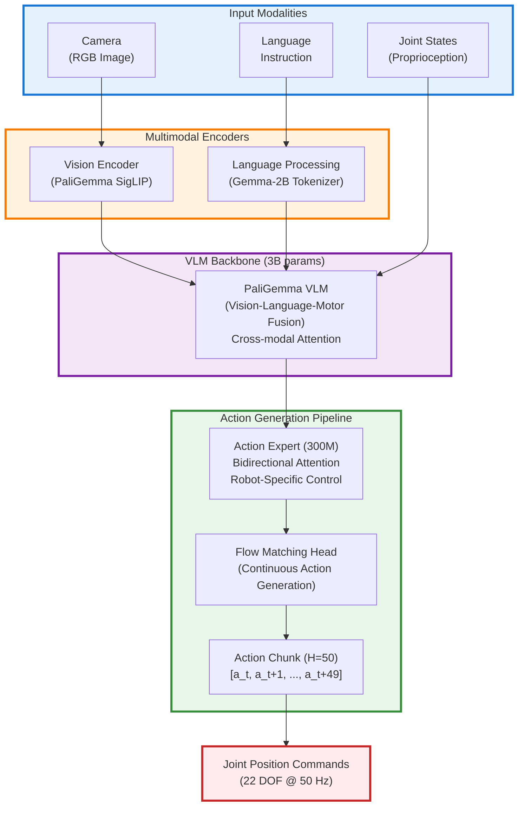

# Physical Intelligence π0 Integration Guide

Comprehensive guide for integrating Physical Intelligence's π0 (pi-zero) vision-language-action (VLA) foundation model with Berkeley Humanoid Lite.

## Table of Contents

1. [What is π0?](#what-is-π0)
2. [Model Variants](#model-variants)
3. [Architecture Overview](#architecture-overview)
4. [Hardware Requirements](#hardware-requirements)
5. [Integration Approach](#integration-approach)
6. [Phase 1: Environment Setup](#phase-1-environment-setup)
7. [Phase 2: Data Collection](#phase-2-data-collection)
8. [Phase 3: Fine-Tuning](#phase-3-fine-tuning)
9. [Phase 4: Evaluation](#phase-4-evaluation)
10. [Phase 5: Deployment](#phase-5-deployment)
11. [Comparison with Other Approaches](#comparison-with-other-approaches)
12. [Performance Optimization](#performance-optimization)
13. [Troubleshooting](#troubleshooting)
14. [References](#references)

---

## What is π0?

**π0 (pi-zero)** is a general-purpose robot foundation model developed by Physical Intelligence, designed to control any robot to perform any task. It represents a breakthrough in Vision-Language-Action (VLA) models that combine vision understanding, natural language comprehension, and motor control in a single unified model.

### Key Features

- **3.3 Billion Parameters**: 3B parameter VLM backbone + 300M parameter action expert
- **Flow Matching Architecture**: Novel approach enabling smooth, continuous action generation
- **High-Frequency Control**: 50Hz real-time control for dexterous manipulation
- **Cross-Embodiment Learning**: Pre-trained on 10k+ hours across 7 robot platforms and 68 tasks
- **Language-Conditioned**: Natural language instructions guide behavior
- **Zero-Shot & Few-Shot Capable**: Can perform tasks with minimal or no additional training
- **Open Source**: Released February 2025 via [openpi repository](https://github.com/Physical-Intelligence/openpi)

### What π0 Can Do

Demonstrated capabilities include:
- Laundry folding from hampers
- Table bussing and cleaning
- Cardboard box assembly
- Grocery bagging and packing
- Dexterous manipulation (pen uncapping, cable routing)
- Mobile manipulation in new environments
- Language-guided task execution

### Training Data

π0 was trained on diverse robotic data including:
- **OXE Dataset**: Large-scale open-source robot data
- **7 Robot Platforms**: Single-arm, dual-arm, mobile manipulators
- **68 Unique Tasks**: Manipulation, locomotion, mobile manipulation
- **Fine-Tuning**: Physical Intelligence found 1-20 hours of data sufficient for task adaptation

---

## Model Variants

Physical Intelligence offers three π0 variants optimized for different use cases:

### π0 Base

**Architecture**: Flow matching-based action generation
**Size**: 3.3B parameters
**Speed**: Standard (1x baseline)
**Use Case**: General-purpose robotics, highest quality motion

**Characteristics**:
- Diffusion/flow matching for continuous actions
- Smooth, high-quality trajectories
- Best for dexterous manipulation
- Pre-trained on diverse robot data

**Checkpoints**:
```
gs://openpi-assets/checkpoints/pi0_base
```

### π0-FAST

**Architecture**: Autoregressive with FAST tokenization
**Size**: 3.3B parameters
**Speed**: 5x faster training, ~4-5x slower inference
**Use Case**: Better language-following, faster experimentation

**Characteristics**:
- Frequency-space Action Sequence Tokenization (FAST)
- Stronger generalization across embodiments
- Superior language understanding
- Faster to fine-tune on new tasks

**Checkpoints**:
```
gs://openpi-assets/checkpoints/pi0_fast_base
```

### π0.5 (Latest)

**Architecture**: Extended π0 with open-world generalization
**Size**: 3.3B parameters
**Speed**: Similar to π0 base
**Use Case**: Mobile manipulation, new environments

**Characteristics**:
- Open-world scene understanding
- Mobile manipulator control
- Generalizes to unseen kitchens, bedrooms
- Released April 2025

**Checkpoints**:
```
gs://openpi-assets/checkpoints/pi05_base
```

### Recommendation for Berkeley Humanoid Lite

**Start with π0-FAST** because:
1. Faster fine-tuning (5x speedup) = faster iteration
2. Better language-following for instruction-based behaviors
3. Stronger cross-embodiment generalization
4. Inference speed matters less for 50Hz locomotion (vs 1kHz manipulation)

**Switch to π0 Base if**:
- Motion quality/smoothness is critical
- You have sufficient training compute
- You need the absolute best trajectory generation

---

## Architecture Overview

### High-Level Design



### Component Details

#### 1. Vision Encoder (PaliGemma SigLIP)

Processes RGB images into visual tokens:
- Input: 224x224 RGB images (typically)
- Output: Image token embeddings
- Pre-trained on web-scale image-text data

#### 2. Language Encoder (Gemma-2B)

Processes natural language instructions:
- Input: Text string (e.g., "walk forward", "pick up the box")
- Output: Language token embeddings
- Part of PaliGemma VLM backbone

#### 3. VLM Backbone (3B params)

Fuses vision, language, and proprioceptive state:
- **Prefix tokens**: Images + text with full mutual attention
- **State tokens**: Robot observations (joint angles, velocities)
- **Cross-modal fusion**: Combines all modalities

#### 4. Action Expert (300M params)

Specialized transformer for action prediction:
- Initialized from scratch (not pre-trained)
- **Bidirectional attention** across action tokens
- Learns robot-specific motor control patterns

#### 5. Flow Matching Head

Generates continuous action trajectories:
- **π0 Base**: Uses flow matching (continuous diffusion)
- **π0-FAST**: Uses FAST tokenization (discrete autoregressive)
- **Output**: Action chunk A_t = [a_t, a_t+1, ..., a_t+49]

### Action Chunking

π0 predicts 50 future actions at once (horizon H=50):

```python
# At timestep t, predict actions for next 50 steps
action_chunk = [
    a_t,      # Execute immediately
    a_t+1,    # Execute at t+1
    a_t+2,    # Execute at t+2
    ...
    a_t+49    # Execute at t+49
]

# Benefits:
# - Smooth, consistent trajectories
# - Reduced high-frequency noise
# - Better temporal coherence
# - Lower inference overhead (1 forward pass per 50 steps)
```

For Berkeley Humanoid Lite (22 DOF), each action a_t is a 22-dimensional vector of joint targets.

### Token Types

1. **Prefix Tokens** (Images + Text)
   - Full self-attention
   - Scene understanding and language grounding

2. **State Tokens** (Proprioception)
   - Attend to prefix and previous states
   - Triangular/causal attention pattern
   - Current joint positions, velocities

3. **Action Tokens** (Motor Commands)
   - Full bidirectional attention (non-causal)
   - Generate future action sequences
   - 50-step chunks for smooth control

---

## Hardware Requirements

### Inference (Running Trained Models)

| Component | Minimum | Recommended | Use Case |
|-----------|---------|-------------|----------|
| **GPU Memory** | 8 GB | 16 GB+ | π0 inference at 50Hz |
| **GPU Examples** | RTX 4070 Ti | RTX 4090, A100 | Real-time control |
| **CPU** | 8-core | 16-core+ | Data preprocessing |
| **RAM** | 16 GB | 32 GB+ | Dataset loading |
| **Storage** | 100 GB | 500 GB+ | Checkpoints + datasets |

**Jetson Compatibility**:
- **Jetson Orin Nano Super (8GB)**: Borderline - may work with optimizations (TensorRT, quantization)
- **Jetson AGX Orin (32/64GB)**: Yes - good for onboard inference
- **Jetson AGX Thor (128GB)**: Excellent - full support with headroom

### Fine-Tuning (Training on Custom Data)

| Method | GPU Memory | Example GPU | Training Speed |
|--------|-----------|-------------|----------------|
| **LoRA** | 22.5 GB | RTX 4090 | Medium |
| **Full Fine-Tune** | 70+ GB | A100 80GB, H100 | Fast |
| **Multi-GPU (FSDP)** | 24 GB each | 4x RTX 4090 | Fastest |

**Training Time** (to fine-tune π0 on custom task):
- **1-20 hours of data**: Sufficient for most tasks (per Physical Intelligence)
- **L40 GPU**: 1.5-2 days training (batch size 16)
- **H100 GPU**: 8-12 hours training (batch size 32)
- **Peak VRAM**: 40 GB (batch size 16, bfloat16, 8-bit optimizer)

### Pre-Training (Training from Scratch)

**Not recommended** - Use pre-trained checkpoints. Full pre-training requires:
- Multiple A100/H100 nodes
- Weeks of training time
- 10k+ hours of robot data
- Significant infrastructure

---

## Integration Approach

### Why π0 for Berkeley Humanoid Lite?

**Advantages**:
1. **Language-Guided Control**: Natural language instructions for behaviors
2. **Few-Shot Learning**: Minimal data needed (1-20 hours per task)
3. **Cross-Embodiment Transfer**: Pre-trained on diverse robots
4. **End-to-End**: Vision → Actions (no separate perception/control)
5. **Open Source**: Full code and weights available

**Challenges**:
1. **Data Collection**: Need robot demonstrations (teleoperation or motion capture)
2. **Hardware**: 8+ GB GPU for inference, 22.5+ GB for fine-tuning
3. **Integration Effort**: Medium - need custom data pipeline
4. **Inference Speed**: Slower than RL policies (but sufficient for 50Hz)

**Difficulty Rating**: **Medium** (comparable to LeRobot, easier than Groot N1)

### Integration Timeline

| Phase | Duration | Effort | Output |
|-------|----------|--------|--------|
| 1. Environment Setup | 1-2 days | Low | Working π0 installation |
| 2. Data Collection | 1-2 weeks | Medium | 5-20 hours of demos |
| 3. Fine-Tuning | 2-5 days | Medium | Task-specific policy |
| 4. Evaluation | 3-7 days | Medium | Validated policy |
| 5. Deployment | 1-2 weeks | High | Real robot integration |

**Total**: 4-8 weeks for first working policy

---

## Phase 1: Environment Setup

### Prerequisites

- Ubuntu 22.04 or later
- NVIDIA GPU with 8+ GB VRAM
- CUDA 12.8+ (comes with Isaac Sim 5.0)
- Python 3.11 (already configured in project)
- Git LFS

### Step 1.1: Install openpi Repository

```bash
# Navigate to external libs
cd /home/kranthi/Projects/Berkeley-Humanoid-Lite/.external-libs

# Clone openpi with submodules
git clone --recurse-submodules https://github.com/Physical-Intelligence/openpi.git
cd openpi

# Install using uv (preferred) - skip LFS during sync
GIT_LFS_SKIP_SMUDGE=1 uv sync
GIT_LFS_SKIP_SMUDGE=1 uv pip install -e .
```

**Alternative: Docker Installation**

```bash
# Build Docker image
docker build -t openpi .

# Run container with GPU support
docker run --gpus all -it openpi
```

### Step 1.2: Download Model Checkpoints

Choose a base model checkpoint for fine-tuning:

```bash
# Install Google Cloud CLI (if not already installed)
curl https://sdk.cloud.google.com | bash
exec -l $SHELL

# Download π0-FAST base (recommended for Berkeley Humanoid Lite)
gsutil -m cp -r gs://openpi-assets/checkpoints/pi0_fast_base ./checkpoints/

# Or download π0 base (for highest quality motion)
gsutil -m cp -r gs://openpi-assets/checkpoints/pi0_base ./checkpoints/

# Or download π0.5 base (for open-world generalization)
gsutil -m cp -r gs://openpi-assets/checkpoints/pi05_base ./checkpoints/
```

**Checkpoint sizes**:
- π0 base: ~13 GB
- π0-FAST base: ~13 GB
- π0.5 base: ~13 GB

### Step 1.3: Verify Installation

```bash
# Test imports
python -c "import openpi; print('openpi installed successfully')"

# List available models
python -c "from openpi import list_models; print(list_models())"

# Check GPU availability
python -c "import jax; print(f'JAX devices: {jax.devices()}')"
```

### Step 1.4: Alternative - HuggingFace LeRobot Integration

π0 is also available through HuggingFace's LeRobot framework:

```bash
# In your project root
cd /home/kranthi/Projects/Berkeley-Humanoid-Lite

# Install LeRobot with π0 support
uv pip install -e "git+https://github.com/huggingface/lerobot.git#egg=lerobot[pi0]"

# Download pretrained π0 from HuggingFace Hub
python -c "
from lerobot.common.policies.pi0.modeling_pi0 import Pi0Policy
policy = Pi0Policy.from_pretrained('lerobot/pi0')
print('π0 loaded from HuggingFace Hub')
"
```

**LeRobot benefits**:
- PyTorch instead of JAX (if you prefer PyTorch)
- Integrated with HuggingFace Hub
- Simpler dataset management
- Compatible with LeRobot tooling

**openpi benefits**:
- Official implementation
- Latest model variants (π0.5)
- More fine-tuning examples
- Active development

---

## Phase 2: Data Collection

π0 learns from demonstrations. You need to collect robot interaction data showing the desired behaviors.

### Data Collection Methods

#### Option 1: Motion Capture (Recommended)

Use motion capture to record human demonstrations:

```python
"""
Motion capture data collection for π0 fine-tuning.
Records human demonstrations and retargets to robot.
"""

import numpy as np
import cv2
from typing import Dict, List
import h5py
from dataclasses import dataclass
from pathlib import Path

@dataclass
class DemoFrame:
    """Single frame of demonstration data."""
    timestamp: float
    image: np.ndarray  # RGB camera image
    joint_positions: np.ndarray  # Robot joint angles
    joint_velocities: np.ndarray  # Joint velocities
    action: np.ndarray  # Target joint positions
    language_instruction: str  # Natural language command

class Pi0DataCollector:
    def __init__(
        self,
        camera_id: int = 0,
        robot_dof: int = 22,
        save_dir: str = "./data/pi0_demos",
        fps: int = 30,
    ):
        self.camera = cv2.VideoCapture(camera_id)
        self.camera.set(cv2.CAP_PROP_FPS, fps)
        self.camera.set(cv2.CAP_PROP_FRAME_WIDTH, 224)
        self.camera.set(cv2.CAP_PROP_FRAME_HEIGHT, 224)

        self.robot_dof = robot_dof
        self.save_dir = Path(save_dir)
        self.save_dir.mkdir(parents=True, exist_ok=True)

        self.current_episode: List[DemoFrame] = []

    def record_episode(
        self,
        instruction: str,
        mocap_interface,  # Your motion capture system
        robot_interface,   # Robot state reader
        duration: float = 30.0,
        retargeting_fn = None,  # Function to retarget human → robot
    ):
        """
        Record a single demonstration episode.

        Args:
            instruction: Natural language instruction (e.g., "walk forward")
            mocap_interface: Interface to motion capture system
            robot_interface: Interface to read robot state
            duration: Maximum episode duration (seconds)
            retargeting_fn: Function mapping mocap → robot joints
        """
        import time

        print(f"Recording episode: '{instruction}'")
        print("Press ENTER when ready to start...")
        input()

        start_time = time.time()
        frames = []

        try:
            while time.time() - start_time < duration:
                # Capture camera image
                ret, image = self.camera.read()
                if not ret:
                    print("Warning: Failed to capture image")
                    continue

                # Convert BGR to RGB
                image = cv2.cvtColor(image, cv2.COLOR_BGR2RGB)

                # Get motion capture data
                mocap_pose = mocap_interface.get_pose()

                # Retarget to robot joints
                if retargeting_fn is not None:
                    robot_joints = retargeting_fn(mocap_pose)
                else:
                    # Placeholder - implement your retargeting
                    robot_joints = np.zeros(self.robot_dof)

                # Get current robot state (if available)
                robot_state = robot_interface.get_state()
                joint_pos = robot_state['joint_positions']
                joint_vel = robot_state['joint_velocities']

                # Action = next desired joint positions
                # (typically same as retargeted joints)
                action = robot_joints

                # Record frame
                frame = DemoFrame(
                    timestamp=time.time() - start_time,
                    image=image,
                    joint_positions=joint_pos,
                    joint_velocities=joint_vel,
                    action=action,
                    language_instruction=instruction,
                )
                frames.append(frame)

                # Display progress
                cv2.imshow('Recording', image)
                if cv2.waitKey(1) & 0xFF == ord('q'):
                    break

        except KeyboardInterrupt:
            print("\nRecording interrupted")

        self.current_episode = frames
        print(f"Recorded {len(frames)} frames ({len(frames)/30:.1f}s)")

        return frames

    def save_episode(self, episode_id: int):
        """Save episode to HDF5 format compatible with π0."""
        if not self.current_episode:
            print("No episode to save")
            return

        filename = self.save_dir / f"episode_{episode_id:04d}.hdf5"

        with h5py.File(filename, 'w') as f:
            # Create datasets
            n_frames = len(self.current_episode)

            # Images: (T, H, W, C)
            images = np.stack([frame.image for frame in self.current_episode])
            f.create_dataset('observations/images/head_camera', data=images)

            # Joint positions: (T, DOF)
            joint_pos = np.stack([frame.joint_positions for frame in self.current_episode])
            f.create_dataset('observations/joint_positions', data=joint_pos)

            # Joint velocities: (T, DOF)
            joint_vel = np.stack([frame.joint_velocities for frame in self.current_episode])
            f.create_dataset('observations/joint_velocities', data=joint_vel)

            # Actions: (T, DOF)
            actions = np.stack([frame.action for frame in self.current_episode])
            f.create_dataset('actions', data=actions)

            # Language instruction (stored as attribute)
            instruction = self.current_episode[0].language_instruction
            f.attrs['language_instruction'] = instruction

            # Timestamps
            timestamps = np.array([frame.timestamp for frame in self.current_episode])
            f.create_dataset('timestamps', data=timestamps)

        print(f"Saved episode to {filename}")
        self.current_episode = []

    def collect_dataset(
        self,
        instructions: List[str],
        episodes_per_instruction: int = 10,
        mocap_interface = None,
        robot_interface = None,
        retargeting_fn = None,
    ):
        """
        Collect a full dataset of demonstrations.

        Args:
            instructions: List of language instructions
            episodes_per_instruction: How many demos per instruction
            mocap_interface: Motion capture system
            robot_interface: Robot state reader
            retargeting_fn: Retargeting function
        """
        episode_id = 0

        for instruction in instructions:
            print(f"\n{'='*60}")
            print(f"Instruction: {instruction}")
            print(f"Need {episodes_per_instruction} demonstrations")
            print(f"{'='*60}\n")

            for i in range(episodes_per_instruction):
                print(f"\nDemo {i+1}/{episodes_per_instruction}")

                self.record_episode(
                    instruction=instruction,
                    mocap_interface=mocap_interface,
                    robot_interface=robot_interface,
                    retargeting_fn=retargeting_fn,
                )

                self.save_episode(episode_id)
                episode_id += 1

                print("Episode saved. Press ENTER to continue...")
                input()

        print(f"\nDataset collection complete! {episode_id} episodes saved.")

    def __del__(self):
        """Clean up camera."""
        if hasattr(self, 'camera'):
            self.camera.release()
        cv2.destroyAllWindows()


# Example usage
if __name__ == "__main__":
    collector = Pi0DataCollector(
        camera_id=0,
        robot_dof=22,
        save_dir="./data/berkeley_humanoid_demos",
        fps=30,
    )

    # Define instructions for dataset
    instructions = [
        "walk forward",
        "walk backward",
        "turn left",
        "turn right",
        "stop walking",
        "stand up from sitting",
        "sit down",
        "wave right hand",
        "wave left hand",
        "raise both arms",
    ]

    # Collect 10 demos per instruction = 100 total episodes
    # This gives 50-100 hours of data (depending on episode length)
    collector.collect_dataset(
        instructions=instructions,
        episodes_per_instruction=10,
        mocap_interface=None,  # TODO: Implement your mocap interface
        robot_interface=None,   # TODO: Implement your robot interface
        retargeting_fn=None,    # TODO: Implement retargeting
    )
```

#### Option 2: Teleoperation

Use VR controllers or joystick to directly control robot:

```python
"""
Teleoperation data collection for π0.
Control robot directly and record demonstrations.
"""

import numpy as np
import cv2
from typing import Dict, List
import h5py
import time

class TeleoperationCollector:
    def __init__(
        self,
        camera_id: int = 0,
        robot_dof: int = 22,
        save_dir: str = "./data/teleop_demos",
        control_freq: int = 50,  # Hz
    ):
        self.camera = cv2.VideoCapture(camera_id)
        self.robot_dof = robot_dof
        self.save_dir = Path(save_dir)
        self.save_dir.mkdir(parents=True, exist_ok=True)
        self.control_freq = control_freq
        self.dt = 1.0 / control_freq

    def record_episode(
        self,
        instruction: str,
        controller_interface,  # VR/joystick controller
        robot_interface,       # Robot control interface
    ):
        """
        Record teleoperation demonstration.

        User controls robot via controller while we record:
        - Camera observations
        - Robot state
        - Controller commands
        """
        print(f"Recording teleoperation: '{instruction}'")
        print("Press START button on controller to begin...")

        # Wait for start signal
        while not controller_interface.is_pressed('start'):
            time.sleep(0.1)

        print("Recording! Press STOP to finish.")

        frames = []
        start_time = time.time()

        while not controller_interface.is_pressed('stop'):
            iter_start = time.time()

            # Get camera image
            ret, image = self.camera.read()
            if ret:
                image = cv2.cvtColor(image, cv2.COLOR_BGR2RGB)
            else:
                print("Warning: Failed to capture image")
                continue

            # Get robot state
            robot_state = robot_interface.get_state()
            joint_pos = robot_state['joint_positions']
            joint_vel = robot_state['joint_velocities']

            # Get controller command
            controller_cmd = controller_interface.get_command()

            # Convert controller command to action
            # (implement your controller → robot mapping)
            action = self.controller_to_action(controller_cmd)

            # Send action to robot
            robot_interface.send_action(action)

            # Record frame
            frame = {
                'timestamp': time.time() - start_time,
                'image': image,
                'joint_positions': joint_pos,
                'joint_velocities': joint_vel,
                'action': action,
                'instruction': instruction,
            }
            frames.append(frame)

            # Display
            cv2.imshow('Teleoperation', image)
            cv2.waitKey(1)

            # Maintain control frequency
            elapsed = time.time() - iter_start
            if elapsed < self.dt:
                time.sleep(self.dt - elapsed)

        print(f"Recorded {len(frames)} frames ({len(frames)*self.dt:.1f}s)")
        return frames

    def controller_to_action(self, controller_cmd: Dict) -> np.ndarray:
        """
        Map controller input to robot action.

        Example for humanoid locomotion:
        - Left stick: Forward/backward velocity
        - Right stick: Left/right turning
        - Triggers: Arm movements
        """
        action = np.zeros(self.robot_dof)

        # TODO: Implement your controller mapping
        # This is highly specific to your controller and robot

        return action
```

#### Option 3: Simulation Rollouts

Generate demonstrations from your existing RL policies:

```python
"""
Generate π0 training data from RL policy rollouts.
Uses Isaac Lab RL policies to create demonstrations.
"""

import numpy as np
import torch
from pathlib import Path
import h5py

class RLPolicyDataGenerator:
    def __init__(
        self,
        rl_policy_path: str,
        save_dir: str = "./data/rl_demos",
    ):
        self.policy = self.load_policy(rl_policy_path)
        self.save_dir = Path(save_dir)
        self.save_dir.mkdir(parents=True, exist_ok=True)

    def load_policy(self, policy_path: str):
        """Load trained RSL-RL policy."""
        import onnxruntime as ort

        sess_options = ort.SessionOptions()
        sess_options.graph_optimization_level = ort.GraphOptimizationLevel.ORT_ENABLE_ALL

        providers = ['CUDAExecutionProvider', 'CPUExecutionProvider']
        session = ort.InferenceSession(policy_path, sess_options, providers=providers)

        return session

    def generate_episode(
        self,
        env,  # Isaac Lab environment
        instruction: str,
        max_steps: int = 500,
    ):
        """
        Generate single episode using RL policy.

        Args:
            env: Isaac Lab RL environment
            instruction: Language instruction describing the behavior
            max_steps: Maximum episode length
        """
        frames = []

        obs = env.reset()

        for step in range(max_steps):
            # Get policy action
            action = self.policy.run(
                None,
                {'obs': obs['policy'].cpu().numpy()}
            )[0]

            # Step environment
            obs, reward, done, info = env.step(torch.from_numpy(action).to(env.device))

            # Extract data for π0
            # Note: π0 needs RGB images, but RL policy uses proprioceptive obs
            # You'll need to render images from simulation

            image = env.render(mode='rgb_array')  # Get RGB rendering
            joint_pos = obs['joint_pos'].cpu().numpy()[0]  # First env
            joint_vel = obs['joint_vel'].cpu().numpy()[0]

            frame = {
                'timestamp': step * env.dt,
                'image': image,
                'joint_positions': joint_pos,
                'joint_velocities': joint_vel,
                'action': action[0],  # First env
                'instruction': instruction,
            }
            frames.append(frame)

            if done[0]:
                break

        return frames

    def generate_dataset(
        self,
        env,
        instructions: List[str],
        episodes_per_instruction: int = 50,
    ):
        """
        Generate full dataset from RL policy.

        This creates a "self-supervised" dataset where the RL policy
        provides demonstrations for π0 to learn from.
        """
        episode_id = 0

        for instruction in instructions:
            for i in range(episodes_per_instruction):
                print(f"Generating episode {episode_id}: {instruction} ({i+1}/{episodes_per_instruction})")

                frames = self.generate_episode(env, instruction)
                self.save_episode(frames, episode_id)
                episode_id += 1

        print(f"Generated {episode_id} episodes")


# Example: Generate data from RL policy
if __name__ == "__main__":
    from isaaclab.envs import ManagerBasedRLEnv

    # Load your trained RL environment
    env = ...  # Your Velocity-Berkeley-Humanoid-Lite-v0 environment

    generator = RLPolicyDataGenerator(
        rl_policy_path="logs/rsl_rl/latest/exported/policy.onnx",
        save_dir="data/rl_demos",
    )

    # Map velocity commands to language
    instructions = [
        "walk forward at 0.5 m/s",
        "walk forward at 1.0 m/s",
        "walk backward",
        "turn left while walking",
        "turn right while walking",
        "walk in circle",
    ]

    generator.generate_dataset(env, instructions, episodes_per_instruction=50)
```

### Dataset Format

π0 expects data in specific format. Convert your collected data to π0 format:

```python
"""
Convert Berkeley Humanoid Lite demonstrations to π0 dataset format.
"""

from pathlib import Path
import h5py
import numpy as np
from typing import List, Dict

class Pi0DatasetConverter:
    def __init__(
        self,
        input_dir: str,
        output_dir: str,
        robot_name: str = "berkeley_humanoid_lite",
    ):
        self.input_dir = Path(input_dir)
        self.output_dir = Path(output_dir)
        self.output_dir.mkdir(parents=True, exist_ok=True)
        self.robot_name = robot_name

    def convert_dataset(self):
        """
        Convert all episodes to π0 format.

        π0 expects:
        - observations/images/{camera_name}: (T, H, W, 3) uint8
        - observations/proprio: (T, D) float32
        - actions: (T, A) float32
        - language_instruction: string attribute
        """
        episode_files = sorted(self.input_dir.glob("episode_*.hdf5"))

        print(f"Converting {len(episode_files)} episodes...")

        for i, episode_file in enumerate(episode_files):
            self.convert_episode(episode_file, i)

        # Create dataset metadata
        self.create_metadata(len(episode_files))

        print(f"Conversion complete! Dataset saved to {self.output_dir}")

    def convert_episode(self, episode_file: Path, episode_id: int):
        """Convert single episode to π0 format."""
        with h5py.File(episode_file, 'r') as f_in:
            # Read data
            images = f_in['observations/images/head_camera'][:]
            joint_pos = f_in['observations/joint_positions'][:]
            joint_vel = f_in['observations/joint_velocities'][:]
            actions = f_in['actions'][:]
            instruction = f_in.attrs.get('language_instruction', '')

            # Concatenate proprioceptive observations
            # π0 uses single "proprio" vector
            proprio = np.concatenate([joint_pos, joint_vel], axis=-1)

            # Create output file
            output_file = self.output_dir / f"{self.robot_name}_episode_{episode_id:05d}.hdf5"

            with h5py.File(output_file, 'w') as f_out:
                # Observations
                obs_group = f_out.create_group('observations')

                # Images
                img_group = obs_group.create_group('images')
                img_group.create_dataset(
                    'head_camera',
                    data=images,
                    compression='gzip',
                    compression_opts=4,
                )

                # Proprioception
                obs_group.create_dataset('proprio', data=proprio)

                # Actions
                f_out.create_dataset('actions', data=actions)

                # Metadata
                f_out.attrs['language_instruction'] = instruction
                f_out.attrs['robot_name'] = self.robot_name
                f_out.attrs['num_frames'] = len(actions)

    def create_metadata(self, num_episodes: int):
        """Create dataset metadata file."""
        metadata_file = self.output_dir / 'dataset_info.yaml'

        metadata = f"""
name: {self.robot_name}_demos
robot: {self.robot_name}
num_episodes: {num_episodes}
control_frequency: 50  # Hz
observation_space:
  images:
    head_camera:
      shape: [224, 224, 3]
      dtype: uint8
  proprio:
    shape: [44]  # 22 joint pos + 22 joint vel
    dtype: float32
action_space:
  shape: [22]  # 22 DOF
  dtype: float32
"""

        with open(metadata_file, 'w') as f:
            f.write(metadata)


# Example usage
if __name__ == "__main__":
    converter = Pi0DatasetConverter(
        input_dir="./data/berkeley_humanoid_demos",
        output_dir="./data/pi0_dataset",
        robot_name="berkeley_humanoid_lite",
    )

    converter.convert_dataset()
```

### Data Requirements

**Minimum Data** (per Physical Intelligence):
- 1-20 hours per task
- ~5-10 demonstrations per instruction
- Multiple camera angles helpful but not required

**Recommended Data**:
- 10-50 hours for robust performance
- 20-50 demonstrations per instruction
- Varied conditions (lighting, backgrounds, starting positions)
- Multiple demonstrators (if using teleoperation/mocap)

---

## Phase 3: Fine-Tuning

Fine-tune π0 base model on your Berkeley Humanoid Lite demonstrations.

### Step 3.1: Configure Fine-Tuning

Create configuration file for your robot:

```python
# configs/berkeley_humanoid_lite_config.py
"""
π0 fine-tuning configuration for Berkeley Humanoid Lite.
Based on openpi LIBERO example config.
"""

from dataclasses import dataclass
from typing import Optional
import jax.numpy as jnp

@dataclass
class BerkeleyHumanoidInputs:
    """Define input data mapping."""

    # Image observations
    image_keys = ['head_camera']  # Camera name in dataset
    image_size = (224, 224)       # Resize to 224x224 for π0

    # Proprioceptive observations
    # π0 expects flat proprio vector
    proprio_keys = ['proprio']  # Contains [joint_pos, joint_vel]
    proprio_dim = 44            # 22 DOF * 2 (pos + vel)

    # Robot embodiment
    robot_name = "berkeley_humanoid_lite"
    action_dim = 22             # 22 DOF joint targets

    # Action normalization
    action_mean = jnp.zeros(22)  # Compute from dataset
    action_std = jnp.ones(22)    # Compute from dataset

@dataclass
class BerkeleyHumanoidOutputs:
    """Define output action mapping."""

    # Action space
    action_dim = 22
    action_horizon = 50  # π0 predicts 50-step chunks

    # Action bounds (in radians for revolute joints)
    action_low = jnp.array([
        # Fill in your joint limits
        -jnp.pi, -jnp.pi, ...  # 22 values
    ])
    action_high = jnp.array([
        jnp.pi, jnp.pi, ...  # 22 values
    ])

@dataclass
class TrainConfig:
    """Fine-tuning hyperparameters."""

    # Model
    model_name = "pi0_fast_base"  # or "pi0_base"
    checkpoint_path = "./checkpoints/pi0_fast_base"

    # Data
    dataset_path = "./data/pi0_dataset"
    batch_size = 16  # Adjust based on GPU memory
    num_workers = 4

    # Training
    learning_rate = 5e-5
    num_epochs = 100
    warmup_steps = 500
    gradient_clip = 1.0

    # Fine-tuning method
    use_lora = True  # Use LoRA for efficient fine-tuning
    lora_rank = 16   # LoRA rank
    lora_alpha = 32  # LoRA alpha

    # Optimization
    optimizer = "adamw"
    weight_decay = 0.01
    betas = (0.9, 0.999)

    # Mixed precision
    use_bfloat16 = True  # Save memory, slight quality loss

    # Checkpointing
    save_every_n_epochs = 10
    checkpoint_dir = "./checkpoints/berkeley_humanoid_fine_tuned"

    # Logging
    log_every_n_steps = 10
    eval_every_n_epochs = 5
    use_tensorboard = True
    log_dir = "./logs/pi0_training"
```

### Step 3.2: Implement Fine-Tuning Script

```bash
# Fine-tune π0-FAST on Berkeley Humanoid Lite data
cd /home/kranthi/Projects/Berkeley-Humanoid-Lite/.external-libs/openpi

# Using openpi (JAX)
python scripts/train.py \
    --config configs/berkeley_humanoid_lite_config.py \
    --data_dir ./data/pi0_dataset \
    --checkpoint_path ./checkpoints/pi0_fast_base \
    --output_dir ./checkpoints/berkeley_humanoid_fine_tuned \
    --num_epochs 100 \
    --batch_size 16 \
    --learning_rate 5e-5 \
    --use_lora \
    --lora_rank 16 \
    --gpus 1

# Alternative: Using LeRobot (PyTorch)
cd /home/kranthi/Projects/Berkeley-Humanoid-Lite

python lerobot/scripts/train.py \
    --policy.type=pi0 \
    --policy.pretrained_path=lerobot/pi0 \
    --dataset.repo_id=local \
    --dataset.local_files_only=true \
    --dataset.root=./data/pi0_dataset \
    --training.num_epochs=100 \
    --training.batch_size=16 \
    --training.learning_rate=5e-5 \
    --training.use_lora=true \
    --training.lora_rank=16 \
    --output_dir=./logs/pi0_berkeley_humanoid
```

### Step 3.3: Monitor Training

Launch TensorBoard to monitor fine-tuning:

```bash
# openpi training logs
tensorboard --logdir ./logs/pi0_training

# LeRobot training logs
tensorboard --logdir ./logs/pi0_berkeley_humanoid

# Open browser to http://localhost:6006
```

**Key metrics to watch**:
- **Total loss**: Should decrease steadily
- **Action prediction loss**: Most important - should decrease
- **Learning rate**: Should decay from 5e-5
- **Gradient norm**: Should stay below clip threshold

**Training time estimates**:
- **RTX 4090 (LoRA)**: 8-12 hours for 100 epochs
- **A100 (LoRA)**: 4-6 hours for 100 epochs
- **H100 (Full fine-tune)**: 8-12 hours for 100 epochs

### Step 3.4: Advanced - Full Fine-Tuning

For best performance, fine-tune all parameters (requires 70+ GB VRAM):

```bash
# Full fine-tuning (no LoRA)
python scripts/train.py \
    --config configs/berkeley_humanoid_lite_config.py \
    --data_dir ./data/pi0_dataset \
    --checkpoint_path ./checkpoints/pi0_fast_base \
    --output_dir ./checkpoints/berkeley_humanoid_full \
    --num_epochs 100 \
    --batch_size 32 \  # Larger batch with more memory
    --learning_rate 5e-5 \
    --use_lora false \  # Disable LoRA
    --fsdp_devices 2 \  # Use FSDP across 2 GPUs
    --gpus 2

# Or multi-GPU with Fully Sharded Data Parallel
XLA_PYTHON_CLIENT_MEM_FRACTION=0.95 python scripts/train.py \
    --config configs/berkeley_humanoid_lite_config.py \
    --fsdp_devices 4 \  # Shard across 4 GPUs
    --batch_size 64 \
    --gpus 4
```

---

## Phase 4: Evaluation

Validate fine-tuned policy before deploying to real robot.

### Step 4.1: Inference in Simulation

Test policy in Isaac Lab simulation:

```python
"""
Evaluate π0 policy in Isaac Lab simulation.
"""

import torch
import numpy as np
from pathlib import Path

class Pi0SimEvaluator:
    def __init__(
        self,
        policy_checkpoint: str,
        use_lerobot: bool = False,
    ):
        """
        Initialize π0 policy for evaluation.

        Args:
            policy_checkpoint: Path to fine-tuned checkpoint
            use_lerobot: Use LeRobot (PyTorch) vs openpi (JAX)
        """
        self.use_lerobot = use_lerobot

        if use_lerobot:
            self.policy = self.load_lerobot_policy(policy_checkpoint)
        else:
            self.policy = self.load_openpi_policy(policy_checkpoint)

        self.action_buffer = []  # Action chunk buffer
        self.current_instruction = ""

    def load_lerobot_policy(self, checkpoint_path: str):
        """Load policy from LeRobot checkpoint."""
        from lerobot.common.policies.pi0.modeling_pi0 import Pi0Policy

        policy = Pi0Policy.from_pretrained(checkpoint_path)
        policy.eval()
        policy = policy.to('cuda')

        return policy

    def load_openpi_policy(self, checkpoint_path: str):
        """Load policy from openpi checkpoint."""
        from openpi import load_policy

        policy = load_policy(checkpoint_path)
        return policy

    def set_instruction(self, instruction: str):
        """Set natural language instruction."""
        self.current_instruction = instruction
        self.action_buffer = []  # Clear buffer on new instruction

    def get_action(
        self,
        observation: dict,
        instruction: str = None,
    ) -> np.ndarray:
        """
        Get action from π0 policy.

        Args:
            observation: Dict with 'image' and 'proprio' keys
            instruction: Optional language instruction (uses cached if None)

        Returns:
            action: (22,) array of joint targets
        """
        if instruction is not None:
            self.set_instruction(instruction)

        # π0 predicts 50-step chunks - use buffer to avoid inference every step
        if len(self.action_buffer) == 0:
            # Need new chunk - run inference
            action_chunk = self.predict_action_chunk(observation)
            self.action_buffer = list(action_chunk)

        # Pop next action from buffer
        action = self.action_buffer.pop(0)

        return action

    def predict_action_chunk(self, observation: dict) -> np.ndarray:
        """
        Run policy inference to get 50-step action chunk.

        Args:
            observation: Dict with 'image' and 'proprio' keys

        Returns:
            action_chunk: (50, 22) array of actions
        """
        if self.use_lerobot:
            # LeRobot PyTorch interface
            obs_dict = {
                'observation.images.head_camera': torch.from_numpy(observation['image']).unsqueeze(0).to('cuda'),
                'observation.state': torch.from_numpy(observation['proprio']).unsqueeze(0).to('cuda'),
                'task': self.current_instruction,
            }

            with torch.no_grad():
                action_chunk = self.policy.predict(obs_dict)

            return action_chunk.cpu().numpy()[0]

        else:
            # openpi JAX interface
            import jax.numpy as jnp

            obs_dict = {
                'image': jnp.array(observation['image'])[None],  # Add batch dim
                'proprio': jnp.array(observation['proprio'])[None],
                'instruction': self.current_instruction,
            }

            action_chunk = self.policy(obs_dict)

            return np.array(action_chunk[0])


# Evaluation script
def evaluate_policy_in_isaaclab(
    policy_checkpoint: str,
    num_episodes: int = 10,
):
    """
    Evaluate π0 policy in Isaac Lab.

    Args:
        policy_checkpoint: Path to fine-tuned checkpoint
        num_episodes: Number of evaluation episodes
    """
    from isaaclab.app import AppLauncher

    # Launch Isaac Sim
    app_launcher = AppLauncher(headless=False)

    from isaaclab.envs import ManagerBasedRLEnv
    import berkeley_humanoid_lite.tasks

    # Create environment
    env_cfg = ...  # Your Velocity-Berkeley-Humanoid-Lite-v0 config
    env = ManagerBasedRLEnv(env_cfg)

    # Load π0 policy
    evaluator = Pi0SimEvaluator(policy_checkpoint, use_lerobot=True)

    # Test instructions
    instructions = [
        "walk forward",
        "walk backward",
        "turn left",
        "turn right",
        "stop walking",
    ]

    results = []

    for instruction in instructions:
        print(f"\nTesting: {instruction}")

        for episode in range(num_episodes):
            # Reset environment
            obs = env.reset()

            # Set instruction
            evaluator.set_instruction(instruction)

            episode_reward = 0
            episode_length = 0

            for step in range(500):  # Max 500 steps
                # Extract observation for π0
                # Note: Isaac Lab obs is torch tensors, convert to numpy
                image = env.render(mode='rgb_array')  # Get RGB image
                joint_pos = obs['joint_pos'].cpu().numpy()[0]
                joint_vel = obs['joint_vel'].cpu().numpy()[0]
                proprio = np.concatenate([joint_pos, joint_vel])

                pi0_obs = {
                    'image': image,
                    'proprio': proprio,
                }

                # Get action from π0
                action = evaluator.get_action(pi0_obs, instruction)

                # Step environment
                obs, reward, done, info = env.step(
                    torch.from_numpy(action).unsqueeze(0).to(env.device)
                )

                episode_reward += reward[0].item()
                episode_length += 1

                if done[0]:
                    break

            result = {
                'instruction': instruction,
                'episode': episode,
                'reward': episode_reward,
                'length': episode_length,
                'success': info.get('success', False),
            }
            results.append(result)

            print(f"  Episode {episode}: reward={episode_reward:.2f}, length={episode_length}")

    # Summarize results
    print("\n" + "="*60)
    print("Evaluation Summary")
    print("="*60)

    for instruction in instructions:
        instr_results = [r for r in results if r['instruction'] == instruction]
        avg_reward = np.mean([r['reward'] for r in instr_results])
        success_rate = np.mean([r['success'] for r in instr_results])

        print(f"{instruction:20s}: reward={avg_reward:6.2f}, success={success_rate:5.1%}")

    env.close()


if __name__ == "__main__":
    evaluate_policy_in_isaaclab(
        policy_checkpoint="./logs/pi0_berkeley_humanoid/final_checkpoint",
        num_episodes=10,
    )
```

### Step 4.2: Run Evaluation

```bash
# Evaluate in Isaac Lab simulation
uv run python scripts/evaluate_pi0.py \
    --checkpoint logs/pi0_berkeley_humanoid/final_checkpoint \
    --num_episodes 10 \
    --task Velocity-Berkeley-Humanoid-Lite-v0

# Generate evaluation report
uv run python scripts/evaluate_pi0.py \
    --checkpoint logs/pi0_berkeley_humanoid/final_checkpoint \
    --num_episodes 50 \
    --save_video \
    --output_report evaluation_results.json
```

### Step 4.3: Qualitative Assessment

**Key questions**:
1. Does robot follow language instructions correctly?
2. Are movements smooth and natural?
3. Does policy generalize to varied conditions?
4. How does it compare to RL baseline?

**Common issues**:
- **Jerky motions**: May need longer training or more data
- **Ignores instructions**: Check language encoder, may need more varied instructions in dataset
- **Poor generalization**: Need more diverse demonstrations
- **Unstable**: Check action bounds, may need action smoothing

---

## Phase 5: Deployment

Deploy fine-tuned π0 policy to real Berkeley Humanoid Lite robot.

### Step 5.1: Export Policy for Deployment

Convert to efficient inference format:

```python
"""
Export π0 policy for real-time deployment.
Converts to ONNX or TorchScript for faster inference.
"""

import torch
from pathlib import Path

def export_pi0_to_onnx(
    checkpoint_path: str,
    output_path: str,
    opset_version: int = 17,
):
    """
    Export π0 policy to ONNX format.

    Args:
        checkpoint_path: Fine-tuned checkpoint path
        output_path: Where to save ONNX model
        opset_version: ONNX opset version
    """
    from lerobot.common.policies.pi0.modeling_pi0 import Pi0Policy

    # Load policy
    policy = Pi0Policy.from_pretrained(checkpoint_path)
    policy.eval()
    policy = policy.to('cuda')

    # Create dummy inputs
    batch_size = 1
    dummy_inputs = {
        'observation.images.head_camera': torch.randn(batch_size, 3, 224, 224, device='cuda'),
        'observation.state': torch.randn(batch_size, 44, device='cuda'),  # 22 pos + 22 vel
        'task': "walk forward",  # Language instruction
    }

    # Export to ONNX
    torch.onnx.export(
        policy,
        dummy_inputs,
        output_path,
        opset_version=opset_version,
        input_names=['image', 'proprio', 'task'],
        output_names=['action_chunk'],
        dynamic_axes={
            'image': {0: 'batch_size'},
            'proprio': {0: 'batch_size'},
            'action_chunk': {0: 'batch_size'},
        },
    )

    print(f"Exported π0 policy to {output_path}")


def export_pi0_to_tensorrt(
    onnx_path: str,
    output_path: str,
    fp16: bool = True,
):
    """
    Convert ONNX model to TensorRT for maximum speed.

    Requires TensorRT installed (comes with Isaac Sim/Jetson).

    Args:
        onnx_path: Path to ONNX model
        output_path: Where to save TensorRT engine
        fp16: Use FP16 precision (faster, slight quality loss)
    """
    import tensorrt as trt

    logger = trt.Logger(trt.Logger.WARNING)
    builder = trt.Builder(logger)
    network = builder.create_network(
        1 << int(trt.NetworkDefinitionCreationFlag.EXPLICIT_BATCH)
    )
    parser = trt.OnnxParser(network, logger)

    # Parse ONNX
    with open(onnx_path, 'rb') as f:
        if not parser.parse(f.read()):
            for error in range(parser.num_errors):
                print(parser.get_error(error))
            raise RuntimeError("Failed to parse ONNX model")

    # Build config
    config = builder.create_builder_config()
    config.set_memory_pool_limit(trt.MemoryPoolType.WORKSPACE, 4 << 30)  # 4 GB

    if fp16:
        config.set_flag(trt.BuilderFlag.FP16)

    # Build engine
    print("Building TensorRT engine (this may take several minutes)...")
    engine = builder.build_serialized_network(network, config)

    # Save engine
    with open(output_path, 'wb') as f:
        f.write(engine)

    print(f"TensorRT engine saved to {output_path}")


if __name__ == "__main__":
    # Export trained policy
    export_pi0_to_onnx(
        checkpoint_path="./logs/pi0_berkeley_humanoid/final_checkpoint",
        output_path="./deployments/pi0_policy.onnx",
    )

    # Convert to TensorRT (optional, for maximum speed)
    export_pi0_to_tensorrt(
        onnx_path="./deployments/pi0_policy.onnx",
        output_path="./deployments/pi0_policy.trt",
        fp16=True,
    )
```

### Step 5.2: Implement Real Robot Interface

```python
"""
Deploy π0 policy to real Berkeley Humanoid Lite robot.
"""

import numpy as np
import cv2
import onnxruntime as ort
from typing import Optional
import time

class Pi0RealRobotController:
    def __init__(
        self,
        policy_path: str,
        robot_interface,
        camera_id: int = 0,
        control_freq: int = 50,  # Hz
        use_tensorrt: bool = False,
    ):
        """
        Initialize π0 controller for real robot.

        Args:
            policy_path: Path to exported ONNX/TensorRT policy
            robot_interface: Your robot control interface
            camera_id: Camera device ID
            control_freq: Control frequency (Hz)
            use_tensorrt: Use TensorRT engine instead of ONNX
        """
        self.robot = robot_interface
        self.control_freq = control_freq
        self.dt = 1.0 / control_freq

        # Initialize camera
        self.camera = cv2.VideoCapture(camera_id)
        self.camera.set(cv2.CAP_PROP_FRAME_WIDTH, 224)
        self.camera.set(cv2.CAP_PROP_FRAME_HEIGHT, 224)
        self.camera.set(cv2.CAP_PROP_FPS, 30)

        # Load policy
        if use_tensorrt:
            self.session = self.load_tensorrt_policy(policy_path)
        else:
            self.session = self.load_onnx_policy(policy_path)

        self.action_buffer = []
        self.current_instruction = ""

    def load_onnx_policy(self, policy_path: str):
        """Load ONNX policy."""
        sess_options = ort.SessionOptions()
        sess_options.graph_optimization_level = ort.GraphOptimizationLevel.ORT_ENABLE_ALL

        providers = [
            ('CUDAExecutionProvider', {
                'device_id': 0,
                'gpu_mem_limit': 2 * 1024 * 1024 * 1024,  # 2 GB
            }),
            'CPUExecutionProvider'
        ]

        session = ort.InferenceSession(policy_path, sess_options, providers=providers)
        return session

    def load_tensorrt_policy(self, policy_path: str):
        """Load TensorRT engine."""
        import tensorrt as trt
        import pycuda.driver as cuda
        import pycuda.autoinit

        logger = trt.Logger(trt.Logger.WARNING)

        with open(policy_path, 'rb') as f:
            engine_data = f.read()

        runtime = trt.Runtime(logger)
        engine = runtime.deserialize_cuda_engine(engine_data)
        context = engine.create_execution_context()

        return context  # Return TensorRT context

    def get_observation(self) -> dict:
        """
        Get current observation from robot sensors.

        Returns:
            obs: Dict with 'image' and 'proprio' keys
        """
        # Capture camera image
        ret, image = self.camera.read()
        if not ret:
            raise RuntimeError("Failed to capture image")

        # Convert BGR to RGB and normalize
        image = cv2.cvtColor(image, cv2.COLOR_BGR2RGB)
        image = image.astype(np.float32) / 255.0

        # Transpose to CHW format (if needed by model)
        image = np.transpose(image, (2, 0, 1))

        # Get robot state
        robot_state = self.robot.get_state()
        joint_pos = robot_state['joint_positions']
        joint_vel = robot_state['joint_velocities']

        # Concatenate proprioception
        proprio = np.concatenate([joint_pos, joint_vel])

        return {
            'image': image,
            'proprio': proprio,
        }

    def predict_action_chunk(self, obs: dict, instruction: str) -> np.ndarray:
        """
        Run policy inference to get 50-step action chunk.

        Args:
            obs: Observation dict
            instruction: Language instruction

        Returns:
            action_chunk: (50, 22) array of actions
        """
        # Prepare inputs
        image = obs['image'][np.newaxis]  # Add batch dim
        proprio = obs['proprio'][np.newaxis]

        # Run inference
        outputs = self.session.run(
            None,
            {
                'image': image,
                'proprio': proprio,
                'task': instruction,
            }
        )

        action_chunk = outputs[0][0]  # Remove batch dim

        return action_chunk

    def execute_instruction(
        self,
        instruction: str,
        duration: float = 10.0,
        safety_check: bool = True,
    ):
        """
        Execute natural language instruction on robot.

        Args:
            instruction: What the robot should do
            duration: Maximum execution time (seconds)
            safety_check: Enable safety checks
        """
        print(f"Executing: '{instruction}'")

        self.current_instruction = instruction
        self.action_buffer = []

        start_time = time.time()
        step = 0

        try:
            while time.time() - start_time < duration:
                iter_start = time.time()

                # Get observation
                obs = self.get_observation()

                # Get action
                if len(self.action_buffer) == 0:
                    # Predict new chunk
                    action_chunk = self.predict_action_chunk(obs, instruction)
                    self.action_buffer = list(action_chunk)

                action = self.action_buffer.pop(0)

                # Safety checks
                if safety_check:
                    action = self.apply_safety_checks(action, obs)

                # Send to robot
                self.robot.send_action(action)

                step += 1

                # Maintain control frequency
                elapsed = time.time() - iter_start
                if elapsed < self.dt:
                    time.sleep(self.dt - elapsed)
                else:
                    print(f"Warning: Control loop running slow ({elapsed:.3f}s > {self.dt:.3f}s)")

        except KeyboardInterrupt:
            print("\nExecution interrupted by user")

        finally:
            # Stop robot
            self.robot.stop()
            print(f"Executed {step} steps in {time.time() - start_time:.1f}s")

    def apply_safety_checks(self, action: np.ndarray, obs: dict) -> np.ndarray:
        """
        Apply safety checks to action before sending to robot.

        Args:
            action: Proposed action
            obs: Current observation

        Returns:
            safe_action: Clipped/modified action
        """
        # 1. Clip to joint limits
        action = np.clip(action, self.robot.joint_limits_low, self.robot.joint_limits_high)

        # 2. Limit maximum joint velocity
        current_pos = obs['proprio'][:22]
        max_delta = self.robot.max_joint_velocity * self.dt
        action = np.clip(action, current_pos - max_delta, current_pos + max_delta)

        # 3. Check for self-collision (optional, if you have collision checker)
        # if self.robot.check_self_collision(action):
        #     print("Warning: Action would cause self-collision, holding position")
        #     action = current_pos

        return action

    def __del__(self):
        """Clean up resources."""
        if hasattr(self, 'camera'):
            self.camera.release()


# Example usage
if __name__ == "__main__":
    from robot_interface import BerkeleyHumanoidInterface  # Your robot interface

    # Initialize robot
    robot = BerkeleyHumanoidInterface(
        can_buses=['can0', 'can1', 'can2', 'can3'],
        control_freq=50,
    )

    # Initialize π0 controller
    controller = Pi0RealRobotController(
        policy_path="./deployments/pi0_policy.onnx",
        robot_interface=robot,
        camera_id=0,
        control_freq=50,
    )

    # Test instructions
    instructions = [
        "stand still",
        "walk forward slowly",
        "walk forward",
        "stop walking",
        "turn left",
        "turn right",
        "wave right hand",
    ]

    for instruction in instructions:
        print(f"\n{'='*60}")
        print(f"Ready to execute: {instruction}")
        print("Press ENTER to start (Ctrl+C to skip)...")
        print(f"{'='*60}\n")

        try:
            input()
            controller.execute_instruction(instruction, duration=5.0)
            time.sleep(1.0)  # Pause between instructions
        except KeyboardInterrupt:
            print("\nSkipping instruction")
            continue

    print("\nDemo complete!")
```

### Step 5.3: Deployment Checklist

Before running on real robot:

**Safety**:
- [ ] Emergency stop button accessible
- [ ] Robot secured/supported (use harness or support stand initially)
- [ ] Joint limits configured correctly
- [ ] Maximum velocity limits set conservatively
- [ ] Collision detection enabled (if available)
- [ ] Test area clear of obstacles

**Technical**:
- [ ] Policy exported and tested in simulation
- [ ] Camera calibrated and working
- [ ] Robot interface tested (can read state, send commands)
- [ ] Control frequency achievable (50Hz target)
- [ ] GPU inference working (8+ GB VRAM)
- [ ] Action bounds verified

**Testing**:
- [ ] Start with simple instructions ("stand still")
- [ ] Gradually increase complexity
- [ ] Test emergency stop functionality
- [ ] Validate smooth motion transitions
- [ ] Check language understanding (try varied phrasings)

### Step 5.4: Deployment on Jetson

If deploying to Jetson Orin Nano Super / AGX Orin:

```bash
# On Jetson device

# 1. Install dependencies
sudo apt-get update
sudo apt-get install -y python3-pip python3-opencv

# 2. Install ONNX Runtime GPU
pip3 install onnxruntime-gpu --extra-index-url https://download.pytorch.org/whl/cu118

# 3. Or build TensorRT engine directly on Jetson
/usr/src/tensorrt/bin/trtexec \
    --onnx=pi0_policy.onnx \
    --saveEngine=pi0_policy.trt \
    --fp16 \
    --workspace=4096

# 4. Set power mode for maximum performance
sudo nvpmodel -m 0  # Max performance mode
sudo jetson_clocks   # Lock clocks to maximum

# 5. Run deployment script
python3 deploy_pi0_jetson.py \
    --policy pi0_policy.trt \
    --use_tensorrt \
    --camera /dev/video0 \
    --control_freq 50
```

**Jetson optimizations**:
- Use TensorRT FP16 for 2x speedup
- Minimize Python overhead (use C++ for critical path if needed)
- Pin process to CPU cores: `taskset -c 0-5 python3 ...`
- Increase GPU memory: `echo 512 | sudo tee /sys/kernel/debug/nvmap/max_carveout`

---

## Comparison with Other Approaches

### π0 vs RL (RSL-RL/PPO)

| Aspect | π0 (VLA) | RL (RSL-RL) | Winner |
|--------|----------|-------------|--------|
| **Training Data** | 1-20 hours demonstrations | Millions of sim steps | π0 (data efficient) |
| **Training Time** | 8-12 hours (fine-tuning) | 2-3 hours (from scratch) | RL (faster) |
| **Language Control** | Natural language instructions | Fixed reward function | π0 (flexible) |
| **Generalization** | Cross-task, cross-embodiment | Single task only | π0 (better) |
| **Sim2Real** | Good (learns from real data) | Challenging (sim-real gap) | π0 (easier) |
| **Inference Speed** | Slower (~50Hz achievable) | Faster (~200Hz+) | RL (faster) |
| **Hardware Req** | 8+ GB GPU | 4+ GB GPU | RL (lighter) |
| **Best For** | Multi-task, language-guided | Single optimized task | Depends |

**When to use π0**:
- Need language-conditioned control
- Want multi-task capabilities
- Have real robot for data collection
- Deploying to new environments frequently

**When to use RL**:
- Single well-defined task (e.g., fast walking)
- Maximum performance on specific task
- Have simulation environment
- Want fastest inference

### π0 vs LeRobot

| Aspect | π0 | LeRobot (ACT/Diffusion) | Winner |
|--------|-----|-------------------------|--------|
| **Model Size** | 3.3B params | 10M-1B params | LeRobot (lighter) |
| **Pre-training** | Web-scale VLM | Robot-specific (or none) | π0 (stronger) |
| **Data Efficiency** | 1-20 hours | 50+ hours | π0 (more efficient) |
| **Language** | Strong language understanding | Limited/none | π0 (better) |
| **Manipulation** | Good | Excellent | LeRobot (specialized) |
| **Locomotion** | Good | Limited | π0 (better) |
| **Community** | Newer | Established | LeRobot (mature) |
| **Ease of Use** | Medium | Easy | LeRobot (simpler) |

**When to use π0**:
- Need language-guided behaviors
- Want strong zero-shot/few-shot
- Full-body humanoid control
- Have limited demonstration data

**When to use LeRobot**:
- Manipulation-focused tasks
- Want lighter models
- Have ample demonstration data
- Prefer simpler pipeline

### π0 vs NVIDIA Groot N1

| Aspect | π0 | Groot N1 | Winner |
|--------|-----|----------|--------|
| **Model Size** | 3.3B params | ~100B+ params | π0 (lighter) |
| **Pre-training** | 10k+ hours robot data | 780k synthetic trajectories | Groot (more data) |
| **Hardware Req** | 8+ GB GPU | 2070 TOPS (Thor) | π0 (accessible) |
| **Open Source** | Yes | No (proprietary) | π0 (open) |
| **Language** | Good | Excellent (VLM backbone) | Groot (better) |
| **Reasoning** | Limited | System 2 reasoning | Groot (better) |
| **Availability** | Now | Q4 2025 | π0 (available) |
| **Cost** | Free | Requires Thor hardware | π0 (affordable) |

**When to use π0**:
- Available now
- Open-source flexibility
- Modest hardware budget
- Want to customize/extend

**When to use Groot N1**:
- Q4 2025 or later
- Need strongest reasoning
- Can afford Thor hardware
- Want NVIDIA ecosystem

### Hybrid Approach

**Best strategy**: Combine multiple approaches!

```python
class HybridController:
    """
    Hybrid controller combining RL, π0, and task-specific policies.
    """

    def __init__(self):
        self.rl_policy = load_rl_policy("rl_walking.onnx")
        self.pi0_policy = load_pi0_policy("pi0_multimodal.onnx")
        self.mode = "rl"  # Start with RL for walking

    def get_action(self, obs, instruction):
        if "walk" in instruction or "run" in instruction:
            # Use RL for optimized locomotion
            return self.rl_policy(obs)
        else:
            # Use π0 for complex tasks
            return self.pi0_policy(obs, instruction)
```

**Recommendation**:
1. **Start with RL**: Get basic locomotion working (walking, turning)
2. **Add π0**: Layer on language-guided behaviors and manipulation
3. **Consider Groot**: Evaluate when available (Q4 2025)

---

## Performance Optimization

### Inference Speed

**Target**: 50Hz control for locomotion (20ms per action)

**Strategies**:

1. **Action Chunking** (Built-in)
   - π0 predicts 50 steps at once
   - Only run inference every 50 steps
   - Effective inference requirement: 1Hz instead of 50Hz!

2. **TensorRT Optimization**
   ```bash
   # Convert ONNX to TensorRT FP16
   trtexec --onnx=pi0.onnx --saveEngine=pi0_fp16.trt --fp16

   # Measure speedup
   trtexec --loadEngine=pi0_fp16.trt --shapes=image:1x3x224x224,proprio:1x44
   ```

   Expected speedup: 2-3x with FP16

3. **Model Quantization**
   ```python
   # INT8 quantization (requires calibration data)
   from onnxruntime.quantization import quantize_dynamic

   quantize_dynamic(
       model_input="pi0.onnx",
       model_output="pi0_int8.onnx",
       weight_type=QuantType.QInt8,
   )
   ```

   Expected speedup: 3-4x with INT8 (slight quality loss)

4. **Reduce Image Resolution**
   - Try 112x112 instead of 224x224
   - 4x fewer pixels = faster inference
   - May hurt vision-dependent tasks

### Memory Optimization

**Problem**: 3.3B model needs ~7-8GB VRAM

**Solutions**:

1. **LoRA Deployment** (if fine-tuned with LoRA)
   - Only deploy LoRA weights + base model
   - Smaller memory footprint
   - No quality loss

2. **Model Distillation**
   ```python
   # Train smaller "student" model to mimic π0
   student = Pi0Small(params=470M)  # π0-small variant

   # Train student to match π0 outputs
   loss = MSE(student(obs), pi0(obs))
   ```

   π0-small: 470M params, much faster

3. **Gradient Checkpointing** (training only)
   - Trade compute for memory during fine-tuning
   - Enables larger batch sizes

### Data Collection Efficiency

**Maximize data quality with minimal effort**:

1. **Start with RL-Generated Data**
   - Use RL policy to generate initial demonstrations
   - Bootstrap π0 training quickly
   - Refine with real human demos later

2. **Active Learning**
   - Deploy π0, identify failure cases
   - Collect targeted demos for failures only
   - Iterative improvement

3. **Data Augmentation**
   - Random crops, color jitter for images
   - Add noise to proprioception
   - Synthesize new instructions (paraphrasing)

---

## Troubleshooting

### Training Issues

**Problem**: Loss not decreasing

**Solutions**:
- Check data quality: visualize demonstrations, ensure diversity
- Reduce learning rate (try 1e-5 instead of 5e-5)
- Increase batch size for more stable gradients
- Verify data preprocessing (normalization, shapes)

**Problem**: Out of memory during training

**Solutions**:
- Enable LoRA: `--use_lora --lora_rank 16`
- Reduce batch size: `--batch_size 8`
- Use gradient checkpointing: `--gradient_checkpointing`
- Use bfloat16: `--use_bfloat16`
- Enable FSDP: `--fsdp_devices 2`

**Problem**: Model overfits (train loss low, eval loss high)

**Solutions**:
- Collect more diverse data
- Add data augmentation
- Reduce model capacity (use LoRA instead of full fine-tune)
- Early stopping based on eval loss

### Deployment Issues

**Problem**: Inference too slow (>20ms per forward pass)

**Solutions**:
- Use TensorRT: Convert ONNX → TensorRT FP16
- Check GPU utilization: `nvidia-smi` (should be near 100%)
- Profile inference: Identify bottlenecks
- Consider INT8 quantization
- Reduce image resolution

**Problem**: Robot ignores language instructions

**Solutions**:
- Check instruction phrasing (try variations)
- Verify training data had similar instructions
- Fine-tune longer on language-diverse data
- Consider π0-FAST (better language understanding)

**Problem**: Jerky, unnatural motions

**Solutions**:
- Verify action chunking enabled (50-step chunks)
- Add action smoothing filter
- Collect smoother demonstrations (slow down teleop)
- Check control frequency (should be 50Hz)

**Problem**: Policy works in sim but fails on real robot

**Solutions**:
- Collect real robot data (π0 benefits from real demonstrations)
- Check camera calibration and image preprocessing
- Verify joint angle conventions match (sim vs real)
- Add sim2real domain randomization during training

### Hardware Issues

**Problem**: Insufficient GPU memory for inference

**Solutions**:
- **Jetson Orin Nano Super (8GB)**:
  - Use TensorRT FP16
  - Consider INT8 quantization
  - May need model distillation to π0-small
- **Upgrade options**:
  - Jetson AGX Orin 32GB: ~$1,599
  - RTX 4070 Ti: 12GB, ~$800

**Problem**: Camera frame rate drops

**Solutions**:
- Check camera bandwidth: Use USB 3.0+
- Reduce resolution: 224x224 sufficient for π0
- Disable camera auto-exposure/auto-white-balance (reduces latency)
- Use hardware-accelerated camera interface (V4L2, GStreamer)

---

## References

### Official Resources

- **π0 Paper**: [arXiv:2410.24164](https://arxiv.org/html/2410.24164v1) - π0: A Vision-Language-Action Flow Model for General Robot Control
- **Official Repository**: [github.com/Physical-Intelligence/openpi](https://github.com/Physical-Intelligence/openpi)
- **Company Blog**: [physicalintelligence.company/blog](https://www.physicalintelligence.company/blog)
- **HuggingFace Integration**: [huggingface.co/blog/pi0](https://huggingface.co/blog/pi0)

### Model Checkpoints

- **π0 Base**: `gs://openpi-assets/checkpoints/pi0_base`
- **π0-FAST Base**: `gs://openpi-assets/checkpoints/pi0_fast_base`
- **π0.5 Base**: `gs://openpi-assets/checkpoints/pi05_base`
- **HuggingFace**: [huggingface.co/lerobot/pi0](https://huggingface.co/lerobot/pi0)

### Related Work

- **PaliGemma** (VLM backbone): Google's vision-language model
- **OpenVLA**: Open-source alternative VLA (7B params)
- **RT-2**: Google's VLA model (55B params)
- **ACT**: Action Chunking Transformer (used in LeRobot)

### Community

- **GitHub Issues**: Report bugs, ask questions
- **HuggingFace Discord**: LeRobot community
- **Physical Intelligence**: Direct feedback to company

---

## Next Steps

After completing this integration guide:

1. **Collect initial dataset**: Start with 5-10 hours of demonstrations
2. **Fine-tune π0-FAST**: Quick experiments with LoRA
3. **Evaluate in simulation**: Validate before real robot deployment
4. **Real robot testing**: Start conservatively, gradually increase complexity
5. **Iterative improvement**: Identify failures, collect targeted data, retrain

**Estimated Timeline**: 4-8 weeks to first working policy

**Integration Difficulty**: **Medium** (comparable to LeRobot, easier than Groot N1)

Good luck! π0 is a powerful foundation model that can unlock language-guided, multi-task control for your Berkeley Humanoid Lite. The key is starting simple, collecting quality demonstrations, and iterating based on real-world performance.
